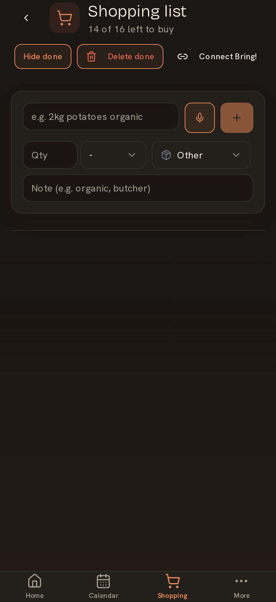
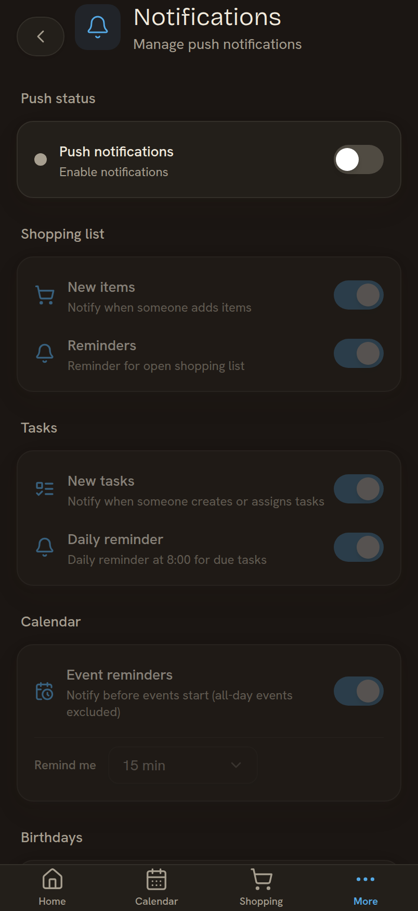
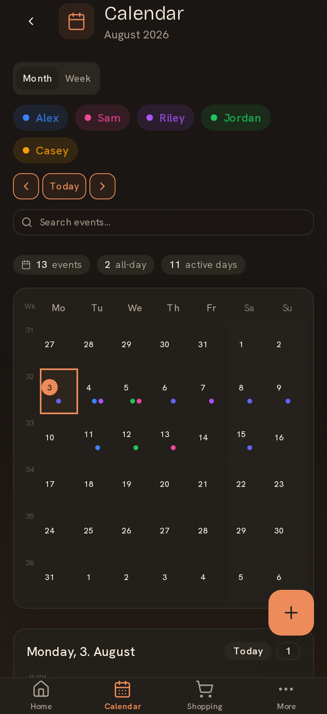
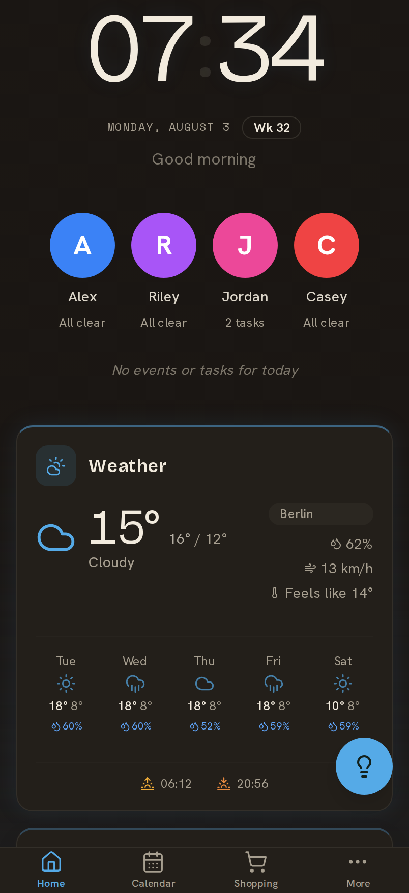

<div align="center">


**A self-hosted family dashboard for the kitchen wall.**
Calendar · weather · photos · shopping list · smart-home — one screen, every device, real-time sync.

[](LICENSE)
[](https://github.com/svenger87/kinboard/actions/workflows/ci.yml)
[](https://github.com/svenger87/kinboard/pkgs/container/kinboard)
[](https://github.com/svenger87/kinboard/releases)
[](https://github.com/svenger87/kinboard/stargazers)
[](https://github.com/svenger87/kinboard/issues)

[](https://github.com/sponsors/svenger87)
[](https://buymeacoffee.com/sven.7687)

<br/>

### **[Visit kinboard.app](https://kinboard.app)** &nbsp;·&nbsp; **[▶ Try the live demo](https://demo.kinboard.app)**

<sub>The landing page at **[kinboard.app](https://kinboard.app)** has the pitch, screenshots, and install path. The demo at **[demo.kinboard.app](https://demo.kinboard.app)** runs the latest tagged release with mock integrations — use join code **`DEMO01`** to load a populated household, or create your own family from scratch. Demo data resets hourly.</sub>

<br/>


<sub>Built for kiosk-style touchscreens but works on any phone, tablet, or browser. Multi-device, multi-person, no cloud account required.</sub>

</div>

---

## Table of contents

- [Why](#why)
- [Features](#features)
- [Quick start](#quick-start)
- [Screenshots](#screenshots)
- [Integrations](#integrations)
- [Tech stack](#tech-stack)
- [Reference hardware build](#reference-hardware-build)
- [Documentation](#documentation)
- [Status & roadmap](#status--roadmap)
- [Contributing](#contributing)
- [Support development](#support-development)
- [Acknowledgements](#acknowledgements)
- [License](#license)

---

## Why

Family logistics are scattered across calendars, chat threads, sticky notes, and "did you check the shopping list?" Kinboard consolidates the daily-driver stuff into one always-on display, so the family knows what's happening without opening apps.

- **Self-hosted.** Your data stays on your hardware. No SaaS, no telemetry, no account gating.
- **Real-time.** Edit a shopping item on your phone, it appears on the kitchen wall in milliseconds (Supabase Realtime over WebSockets).
- **Offline-tolerant.** The shopping list works in the basement supermarket without signal — changes queue locally and replay when the device gets connectivity back.
- **Touch-friendly.** Designed for wall-mounted tablets first; mobile and desktop are first-class too.
- **Modular.** Pick the integrations you actually use; the rest stay invisible.

---

## Features

| Feature | Wiki page |
|---|---|
| **Dashboard** — clock, today strip, configurable widget grid | [Dashboard](https://github.com/svenger87/kinboard/wiki/Dashboard) |
| **Calendar** — two-way sync with Google Calendar **and any CalDAV server**, read-only `.ics` feeds, per-person colors, holidays, waste-pickup widgets | [Calendar](https://github.com/svenger87/kinboard/wiki/Calendar) · [CalDAV](https://github.com/svenger87/kinboard/wiki/CalDAV) |
| **Shopping list** — built-in real-time list with **offline support**, editable from any phone, + dedicated standalone PWA, optional Bring! sync | [Shopping](https://github.com/svenger87/kinboard/wiki/Shopping) |
| **Recipes & meal planning** — Chefkoch.de search + schema.org URL import, weekly meal board, recipe-driven shopping | [Recipes & meals](https://github.com/svenger87/kinboard/wiki/Recipes) |
| **Tasks & todos** — per-person assignment, priorities, daily reminder push | [Tasks & todos](https://github.com/svenger87/kinboard/wiki/Tasks) |
| **Notes** — quick shared sticky notes for the household | [Notes](https://github.com/svenger87/kinboard/wiki/Notes) |
| **Birthdays** — year-ring viz, countdowns, gift-idea tracking | [Birthdays](https://github.com/svenger87/kinboard/wiki/Birthdays) |
| **School schedule** — per-child timetable + auto pack list for tomorrow | [Schedule](https://github.com/svenger87/kinboard/wiki/Schedule) |
| **Smart home** — Home Assistant entities, room tabs, floating-lights master control | [Smart home](https://github.com/svenger87/kinboard/wiki/Smart-Home) |
| **Energy dashboard** — solar / battery / grid live flow + charts | [Smart home → Energy](https://github.com/svenger87/kinboard/wiki/Smart-Home#energy) |
| **Cameras** — live WebRTC streams (via go2rtc) | [Cameras](https://github.com/svenger87/kinboard/wiki/Cameras) |
| **Pocket money** — per-kid virtual accounts with parent-configurable APR, allowance cron, saving goals + parent-approval queue, evolving avatar (5 species × 8 stages) | [Pocket Money](https://github.com/svenger87/kinboard/wiki/Pocket-Money) |
| **Photos** — album grid, full-screen viewer and a dashboard widget; sources: Immich, a DLNA server on your NAS, or an iCloud Shared Album — no account needed for the last two | [Photos](https://github.com/svenger87/kinboard/wiki/Photos) |
| **Photo screensaver** — the same library as the Photos page (Immich monthly album, DLNA, iCloud) or Unsplash as a no-setup fallback, presence-aware blanking | [Screensaver](https://github.com/svenger87/kinboard/wiki/Screensaver) |
| **Weather** — current + hourly + radar (OpenWeatherMap) | [OpenWeatherMap](https://github.com/svenger87/kinboard/wiki/OpenWeatherMap) |
| **Web push notifications** — shopping items, task assignments, daily todo digest. **PWA install** required on iOS. | [Notifications](https://github.com/svenger87/kinboard/wiki/Notifications) |
| **Multi-device + multi-person** — devices join a family with a 6-char code, per-person color coding everywhere | [People & devices](https://github.com/svenger87/kinboard/wiki/People-and-Devices) |
| **Recycle bin** — deleted items are recoverable for a configurable window, because a wall display is touched by everyone in the house | [Recycle bin](https://github.com/svenger87/kinboard/wiki/Recycle-Bin) |
| **Monthly themes** — colors shift through the year automatically | [Themes & locales](https://github.com/svenger87/kinboard/wiki/Themes) |
| **i18n** — English, German, French — partial translations welcome | [Themes & locales](https://github.com/svenger87/kinboard/wiki/Themes) |

The full wiki has a page for every feature plus integration setup, kiosk hardware reference build, security model, and database schema.

---

## Quick start

You need **Docker** (with Compose v2), **Node.js 20+** (for the VAPID key generator that powers push notifications — `setup.sh` uses `npx`; if Node.js is missing, setup completes but push notifications stay disabled), ~2 GB free disk, and ~10 minutes. The bundled `docker-compose.yml` brings up the Next.js app, a self-hosted Supabase stack, and supporting services.

> **RAM**: the local Next.js build peaks around **~4 GB** during type-check and static-page generation. On a 4 GB VM you'll need **≥ 8 GB total swap** to avoid OOM kills during build (`fallocate -l 8G /swapfile && chmod 600 /swapfile && mkswap /swapfile && swapon /swapfile`). Or — recommended — skip the build entirely by using the pre-built image at [`docker-compose.image.yml`](webapp/docker/docker-compose.image.yml). That drops bring-up to ~30 sec and needs only ~512 MB at runtime.

If you don't have Docker yet:

```bash
curl -fsSL https://get.docker.com | sh
```

Then bring Kinboard up:

```bash
git clone https://github.com/svenger87/kinboard.git
cd kinboard
./setup.sh                # generate random secrets + Supabase JWT keys
cd webapp/docker
./start.sh up             # docker compose up -d
```

Open `http://<server-ip>:3001` (or `http://localhost:3001` if local), follow the setup wizard to create your first family, and start adding integrations from `/settings`.

> **Push notifications** require Node.js for VAPID key generation. If `node` isn't on PATH when `setup.sh` runs, push stays disabled (everything else works); install Node.js + re-run `./setup.sh --force` later to enable.

> **Skip the local build** by using the pre-built multi-arch image (amd64 + arm64) at `ghcr.io/svenger87/kinboard:latest`. Drops bring-up to ~30 sec and ~512 MB RAM at runtime instead of 4 GB+ during build. See [`webapp/docker/docker-compose.image.yml`](webapp/docker/docker-compose.image.yml) for the overlay.

### Updating

`./start.sh up` reuses the cached image — fast for restarts but won't pick up new code. After pulling source updates, use:

```bash
git pull
cd webapp/docker
./start.sh restart    # rebuilds the webapp image + recreates webapp + cron
```

**Trying a release candidate** — set `KINBOARD_TAG=next` in `webapp/docker/.env` and bring the stack up again. That follows the pre-release channel; remove the line (or set `latest`) to go back to stable. Release candidates are announced on the [Releases](https://github.com/svenger87/kinboard/releases) page and are where feedback is most useful. See [Self-hosting → Pre-release channel](https://github.com/svenger87/kinboard/wiki/Self-hosting#pre-release-channel).

**Hands-off auto-update** — an optional Diun + webhook overlay watches GHCR for new `kinboard-webapp` images and runs the full upgrade path (pull, migrate, restart) automatically when one lands. Replaces the deprecated Watchtower overlay. See [Self-hosting → Auto-updates](https://github.com/svenger87/kinboard/wiki/Self-hosting#auto-updates) for setup.

For production self-hosting (Traefik + custom domain + backups + updates), see [Self-hosting](https://github.com/svenger87/kinboard/wiki/Self-hosting).

---

## Screenshots

A few highlights from the [demo data set](docs/wiki/screenshots/). See the [wiki](docs/wiki/) for the per-feature pages.

> These were captured before the 1.7.0 interface work (larger type and navigation for wall displays, opaque dialogs, themed device colours). They still show the app faithfully, but the current build looks a little different — [the live demo](https://demo.kinboard.app) is always the newest thing.

### On your phone

The wall display is the point, but you're not always in front of it. The whole app is responsive and installs as a PWA, so the shopping list you edit in the supermarket is on the kitchen wall before you get home, and push notifications reach you when you're out.

<table>
  <tr>
    <td align="center"><a href="docs/wiki/images/mobile/shopping-list-mixed.png"></a><br/><sub><b>Shopping list</b><br/>Add with your thumb,<br/>tick off in the aisle</sub></td>
    <td align="center"><a href="docs/wiki/images/mobile/settings-notifications.png"></a><br/><sub><b>Notifications</b><br/>Per device, so the<br/>wall stays quiet</sub></td>
    <td align="center"><a href="docs/wiki/images/mobile/calendar-month-view.png"></a><br/><sub><b>Calendar</b><br/>Same data, laid out<br/>for a thumb</sub></td>
    <td align="center"><a href="docs/wiki/images/mobile/dashboard-portrait.png"></a><br/><sub><b>Dashboard</b><br/>The same board,<br/>pocket-sized</sub></td>
  </tr>
</table>

### On the wall

<table>
  <tr>
    <td align="center"><a href="docs/wiki/images/shopping-list-mixed.png"></a><br/><sub>Shopping</sub></td>
    <td align="center"><a href="docs/wiki/images/calendar-month-view.png"></a><br/><sub>Calendar</sub></td>
    <td align="center"><a href="docs/wiki/images/home-automation-rooms.png"></a><br/><sub>Home automation</sub></td>
  </tr>
  <tr>
    <td align="center"><a href="docs/wiki/images/energy-flow-diagram.png"></a><br/><sub>Energy dashboard</sub></td>
    <td align="center"><a href="docs/wiki/images/birthdays-year-ring.png"></a><br/><sub>Birthdays</sub></td>
    <td align="center"><a href="docs/wiki/images/recipes-library.png"></a><br/><sub>Recipes</sub></td>
  </tr>
  <tr>
    <td align="center"><a href="docs/wiki/images/meals-week-board.png"></a><br/><sub>Meal planning</sub></td>
    <td align="center"><a href="docs/wiki/images/schedule-week-grid.png"></a><br/><sub>School schedule</sub></td>
    <td align="center"><a href="docs/wiki/images/todos-overview.png"></a><br/><sub>Tasks & todos</sub></td>
  </tr>
</table>

Every screenshot has a light-mode variant with a `-light` suffix, and the phone-viewport captures live in [`docs/wiki/images/mobile/`](docs/wiki/images/mobile/). The full toolchain that produces them — local docker stack with anonymized prod data + mock HA / Tesla / OpenWeatherMap servers + Playwright capture — lives in [`docs/wiki/screenshots/`](docs/wiki/screenshots/).

---

## Integrations

| Service | Purpose | Required? |
| --- | --- | --- |
| Supabase (self-hosted) | Database + realtime sync | Yes (bundled) |
| OpenWeatherMap | Weather forecasts + radar | Optional, free tier OK |
| Google Calendar | Two-way calendar sync | Optional |
| CalDAV (Nextcloud, Radicale, Fastmail, iCloud, …) | Two-way calendar sync without Google | Optional |
| Immich | Photos: screensaver, album viewer and dashboard widget | Optional |
| DLNA media server (MiniDLNA, Jellyfin, Plex, Synology, QNAP) | The same photos off a NAS you already run — no account, no API key | Optional |
| iCloud Shared Album | The same, from a public album link on an iPhone — no Apple ID | Optional |
| Unsplash | Curated stock photos for the screensaver when you have no library of your own | Optional, free tier OK |
| Home Assistant | Smart-home entities and energy — **and, since 1.9.0, [the other way round](https://github.com/svenger87/kinboard-homeassistant): Kinboard's calendar, lists and family state as Home Assistant entities** | Optional |
| Bring! | Shopping list sync (built-in list works without it) | Optional |
| go2rtc | WebRTC camera streams | Optional |

### Kinboard *in* Home Assistant

Most dashboards read Home Assistant. Kinboard also **feeds it** — the family's
day becomes entities you can automate on, in an installation that already runs
your house.

Install from HACS as a custom repository
([svenger87/kinboard-homeassistant](https://github.com/svenger87/kinboard-homeassistant)),
paste a token from **Settings → Integrations**, and you get:

| | |
|---|---|
| **20 entities** | next appointment (with the person's name and start time), what's on today, whose birthday is next, which children have school tomorrow, what's for dinner, open and overdue tasks, pocket money per child, saving-goal progress, and **the next bin collection** |
| **Two real to-do lists** | shopping and tasks as `todo` entities — tick one in Home Assistant and it ticks in Kinboard, add one in Kinboard and it appears there. The To-do card, voice assistants and `todo.*` services all work with no glue |
| **A calendar** | `calendar.kinboard_family_calendar`, including events that merely overlap the day you're looking at |
| **Services** | add a shopping item, create a task, write a note, credit pocket money, dismiss a hint, force a refresh |
| **Events** | a task ticked, a shopping item added, an appointment created, a device joined, a saving goal reached, the day's context changing |

The events come from **database triggers**, not the API layer — so a task ticked
on the kitchen tablet fires one exactly as an automation does. Delivery is
resumable: a restart of either system loses nothing.

```yaml
# The night before: tell everyone what tomorrow's lessons need.
- alias: "Pack the school bag"
  triggers:
    - trigger: time
      at: "19:30:00"
  conditions:
    - condition: template
      value_template: "{{ states('sensor.kinboard_school_tomorrow') not in ['unknown','unavailable',''] }}"
  actions:
    - action: notify.notify
      data:
        message: >-
          {{ states('sensor.kinboard_school_tomorrow') }} has school tomorrow —
          first lesson {{ state_attr('sensor.kinboard_school_tomorrow','first_lesson') }}.
```

Eleven more, ready to paste, in
[`examples/`](https://github.com/svenger87/kinboard-homeassistant/tree/main/examples) —
each one loaded into a real Home Assistant by CI on every run, with every
entity, service and event checked against the integration, so an example cannot
quietly rot.

Permissions are per-token and nothing is implied: a token that may add shopping
items cannot create tasks, and a read-only token cannot write at all.


Niche integrations (Tesla Fleet, Zendure SolarFlow batteries, etc.) ship as opt-in plugins. See the [Plugin development guide](https://github.com/svenger87/kinboard/wiki/Plugin-Development) to write your own.

---

## Tech stack

- **[Next.js](https://nextjs.org/) 16** (App Router) + **[React](https://react.dev/) 19**
- **[shadcn/ui](https://ui.shadcn.com/)** + **[Tailwind CSS](https://tailwindcss.com/)** for UI
- **[TanStack Query](https://tanstack.com/query)** (server state) + **[Zustand](https://zustand-demo.pmnd.rs/)** (client state)
- **[Supabase](https://supabase.com/)** (Postgres + Realtime) — self-hosted
- **[next-intl](https://next-intl.dev/)** for i18n (EN/DE/FR)
- **[Framer Motion](https://www.framer.com/motion/)** for transitions
- **Service worker + IndexedDB** for offline shopping
- **[Playwright](https://playwright.dev/)** for the screenshot capture suite

---

## Reference hardware build

Kinboard is hardware-agnostic — any HDMI display + any small PC works. For people who want a known-good combination, [Reference build](https://github.com/svenger87/kinboard/wiki/Reference-Build) documents one ~€700 setup with a 27" capacitive touchscreen + a Mele Quieter 4C mini-PC + a custom oak frame, with a complete BOM, wiring, and what didn't work.

For software side of the kiosk install: [Windows 11 (Mele 4C)](https://github.com/svenger87/kinboard/wiki/Kiosk-Windows-11-Mele-4C) walks through Edge `--kiosk` mode + the on-screen keyboard, and [Linux guidance](https://github.com/svenger87/kinboard/wiki/Kiosk-Linux-Guidance) covers Cage / GNOME / X11 alternatives.

---

## Documentation

The wiki is the source of truth for everything beyond this README:

- **Getting started** — [Quick-start](https://github.com/svenger87/kinboard/wiki/Quick-start), [Self-hosting](https://github.com/svenger87/kinboard/wiki/Self-hosting)
- **Architecture** — [Architecture overview](https://github.com/svenger87/kinboard/wiki/Architecture), [Security model](https://github.com/svenger87/kinboard/wiki/Security-and-Threat-Model)
- **Built-in features** — [Dashboard](https://github.com/svenger87/kinboard/wiki/Dashboard) · [Calendar](https://github.com/svenger87/kinboard/wiki/Calendar) · [Shopping](https://github.com/svenger87/kinboard/wiki/Shopping) · [Recipes & meals](https://github.com/svenger87/kinboard/wiki/Recipes) · [Tasks](https://github.com/svenger87/kinboard/wiki/Tasks) · [Notes](https://github.com/svenger87/kinboard/wiki/Notes) · [Birthdays](https://github.com/svenger87/kinboard/wiki/Birthdays) · [Schedule](https://github.com/svenger87/kinboard/wiki/Schedule) · [Smart home](https://github.com/svenger87/kinboard/wiki/Smart-Home) · [Screensaver](https://github.com/svenger87/kinboard/wiki/Screensaver) · [People & devices](https://github.com/svenger87/kinboard/wiki/People-and-Devices) · [Notifications](https://github.com/svenger87/kinboard/wiki/Notifications) · [Themes & locales](https://github.com/svenger87/kinboard/wiki/Themes)
- **Integrations** — [Google Calendar](https://github.com/svenger87/kinboard/wiki/Google-Calendar) · [CalDAV](https://github.com/svenger87/kinboard/wiki/CalDAV) · [Home Assistant](https://github.com/svenger87/kinboard/wiki/Home-Assistant) · [Immich](https://github.com/svenger87/kinboard/wiki/Immich) · [Bring!](https://github.com/svenger87/kinboard/wiki/Bring) · [OpenWeatherMap](https://github.com/svenger87/kinboard/wiki/OpenWeatherMap) · [Cameras](https://github.com/svenger87/kinboard/wiki/Cameras)
- **Hardware** — [Reference build (BOM + frame)](https://github.com/svenger87/kinboard/wiki/Reference-Build) · [Windows kiosk](https://github.com/svenger87/kinboard/wiki/Kiosk-Windows-11-Mele-4C) · [Linux guidance](https://github.com/svenger87/kinboard/wiki/Kiosk-Linux-Guidance) · [LD2410 presence sensor](https://github.com/svenger87/kinboard/wiki/Presence-Sensor)
- **Extending Kinboard** — [Vehicles](https://github.com/svenger87/kinboard/wiki/Vehicles) · [Stonks](https://github.com/svenger87/kinboard/wiki/Stonks) · [Pocket Money](https://github.com/svenger87/kinboard/wiki/Pocket-Money) · [Plugin development](https://github.com/svenger87/kinboard/wiki/Plugin-Development) · [Plugin directory](https://github.com/svenger87/kinboard/wiki/Plugin-Directory)
- **[Troubleshooting](https://github.com/svenger87/kinboard/wiki/Troubleshooting)** — known issues + fixes

---

## Status & roadmap

**v1.0.0 shipped 2026-05-04** — first tagged public release. **Latest stable: [v1.6.10](https://github.com/svenger87/kinboard/releases/tag/v1.6.10) (2026-08-06).** Live demo running the latest tag at **[demo.kinboard.app](https://demo.kinboard.app)** (auto-updated via Diun + the self-update webhook; data resets hourly). The project is single-maintainer and developed in personal time; expect periodic activity rather than a Big Co cadence. See the [`CHANGELOG`](CHANGELOG.md) for what's in each release and the [`RELEASE`](RELEASE.md) doc for how releases are cut.

**Security model:** designed for a trusted home network. Do not expose Kinboard directly to the public internet without putting a reverse proxy and authentication layer in front of it. See [Security & threat model](https://github.com/svenger87/kinboard/wiki/Security-and-Threat-Model) and [`SECURITY.md`](SECURITY.md).

### Recently shipped
- [x] **Settings lock, demo completeness, theme-aware sensors** (v1.7.0) — the settings PIN could be bypassed while it was still loading and the prompt could vanish mid-entry; both are closed. Pocket-money settings save again, the getting-started checklist no longer takes over a wall display, and pale sensor and forecast colours are readable in every theme
- [x] **Custom RSS feeds, pocket-money corrections, safer image search** (v1.6.0) — News sources accepts any RSS or Atom feed alongside the built-in publishers; pocket-money goals can finally be renamed, re-targeted and deleted; the saving avatar reflects the current balance rather than lifetime earnings, and daily interest stopped discarding its sub-cent remainder; shopping-list image search moved off scraped search pages that could return unrelated or adult results
- [x] **Restore from backup, meal-plan digest, notification fixes** (v1.5.0) — the join screen can rebuild a whole family from a Kinboard export file; an optional evening push lists tomorrow's planned meals; settings writes now go through the app server instead of straight from the browser to the database; Undo works on the shopping kiosk, offline included
- [x] **Security hardening, backup & export, undo** (v1.4.0) — integration credentials and the settings PIN moved to server-only storage; Settings → Data & backup can export everything to JSON or publish a secret ICS feed of your calendar; deleted items get an Undo toast; birthday reminders now actually send a push; the webapp container reports health for automated monitoring
- [x] **Redesign completion, French, join-code expiry** (v1.3.0) — the flat sage-linen visual refresh reaches nearly every page; Kinboard ships a French interface alongside English and German (community-contributed, #9); Settings can rotate the family join code and set it to expire
- [x] **Onboarding completeness + setup hardening** (v1.2.0) — a persistent getting-started checklist replaces the one-time setup banner, "discover" cards explain empty plugin widgets, Reconnect banners surface rejected Google/Home Assistant credentials, and the stack self-aligns service passwords so a bare `docker compose up` works out of the box
- [x] **Pocket Money plugin, end-to-end auto-update, and nav drag-reorder** (v1.1.0) — per-kid virtual pocket-money accounts with parent-configurable interest and savings goals, a Diun + webhook overlay that pulls and applies new images automatically, and drag-and-drop reordering of the bottom navigation per device. See [Pocket Money](https://github.com/svenger87/kinboard/wiki/Pocket-Money)

### Up next (no fixed dates)
- [ ] Additional Stonks data drivers — paid sources like Polygon or Tiingo for users wanting higher-resolution intraday + cleaner symbol coverage than Yahoo's unofficial endpoints. The driver contract already leaves room; only API-key plumbing and a settings UI need to land
- [ ] News feed per ticker on the Stonks detail page — Yahoo already returns it via `quoteSummary`, just needs UI
- [ ] Per-ticker price alerts via the existing notification queue
- [ ] Drag-reorder for the Stonks watchlist (currently creation-order)
- [x] More community locales (FR shipped in v1.3.0) — additional languages welcome via PR, see [`CONTRIBUTING.md`](CONTRIBUTING.md#translations)

---

## Contributing

Bug reports, feature requests, translations, and code PRs all welcome. The full guide lives in [`CONTRIBUTING.md`](CONTRIBUTING.md) — it covers dev setup, code conventions, the changelog discipline, and the Conventional Commits format. For where to take questions vs. issues vs. discussions, see [`SUPPORT.md`](SUPPORT.md).

Quick orientation:

- **Bugs** — [open an issue](https://github.com/svenger87/kinboard/issues/new?template=bug_report.yml) with logs + the route that broke
- **Features** — open a [GitHub Discussion](https://github.com/svenger87/kinboard/discussions) before a substantial PR
- **Translations** — `webapp/messages/*.json` is the source of truth; PRs adding new locales (FR, ES, IT, NL…) gladly accepted
- **Plugins** — the plugin system isn't carved in stone yet; open a discussion to help shape it
- **Security** — see [`SECURITY.md`](SECURITY.md) — please don't file public issues for credential / data-access vulnerabilities

CI runs ESLint + i18n bundle parity + shellcheck on every PR. The codebase deliberately doesn't run `next build` in CI to keep the dev-server experience predictable; production builds happen in the Docker image workflow.

---

## Support development

Kinboard is built and maintained on personal time. If it's useful to your family and you'd like to keep it healthy:

- **GitHub Sponsors** (recurring) → [github.com/sponsors/svenger87](https://github.com/sponsors/svenger87)
- **Buy Me a Coffee** (one-time tip) → [buymeacoffee.com/sven.7687](https://buymeacoffee.com/sven.7687)
- **Star the repo** — helps others find it
- **Contribute** — bug reports, plugins, translations all welcome
- **Re-run screenshots** — the capture suite is in [`docs/wiki/screenshots/`](docs/wiki/screenshots/) and runs end-to-end against an anonymized demo

[](https://github.com/sponsors/svenger87)
[](https://buymeacoffee.com/sven.7687)

---

## Acknowledgements

Kinboard stands on the shoulders of an incredible amount of open-source work:

- **[Supabase](https://supabase.com/)** — the entire self-hosted backend stack (Postgres, Realtime, GoTrue, PostgREST, Storage)
- **[Next.js](https://nextjs.org/)** + **[Vercel](https://vercel.com/)** — the application framework
- **[shadcn/ui](https://ui.shadcn.com/)** — the component primitives. UI quality starts here.
- **[Lucide](https://lucide.dev/)** — every icon in the app
- **[Framer Motion](https://www.framer.com/motion/)** — the smooth, deliberate transitions
- **[next-intl](https://next-intl.dev/)** — i18n done right for App Router
- **[Home Assistant](https://www.home-assistant.io/)** — the smart-home backbone Kinboard talks to
- **[Immich](https://immich.app/)** — the photo backend that powers the screensaver
- **[Bring!](https://www.getbring.com/)** — the shopping list app some of us still want on a phone
- **[go2rtc](https://github.com/AlexxIT/go2rtc)** — the camera streaming bridge
- **[OpenWeatherMap](https://openweathermap.org/)** — weather data
- **[Chefkoch.de](https://www.chefkoch.de/)** — recipe search source
- **[Faker](https://fakerjs.dev/)** — anonymized demo data for the screenshot toolchain
- **[Playwright](https://playwright.dev/)** — automated screenshot capture

For the specific kiosk hardware combination (display + mini-PC + frame), see [Reference build](https://github.com/svenger87/kinboard/wiki/Reference-Build).

---

## License

MIT — see [`LICENSE`](LICENSE).
