<div align="center">

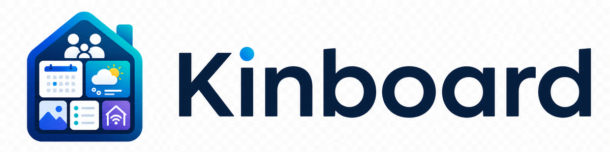

**A self-hosted family dashboard for the kitchen wall.**
Calendar · weather · photos · shopping list · smart-home — one screen, every device, real-time sync.

[](LICENSE)
[](https://github.com/svenger87/kinboard/actions/workflows/ci.yml)
[](https://github.com/svenger87/kinboard/pkgs/container/kinboard)
[](https://github.com/svenger87/kinboard/releases)
[](https://github.com/svenger87/kinboard/stargazers)
[](https://github.com/svenger87/kinboard/issues)

[](https://github.com/sponsors/svenger87)
[](https://buymeacoffee.com/sven.7687)

<br/>

### **[Visit kinboard.app](https://kinboard.app)** &nbsp;·&nbsp; **[▶ Try the live demo](https://demo.kinboard.app)**

<sub>The landing page at **[kinboard.app](https://kinboard.app)** has the pitch, screenshots, and install path. The demo at **[demo.kinboard.app](https://demo.kinboard.app)** runs the latest tagged release with mock integrations — use join code **`DEMO01`** to load a populated household, or create your own family from scratch. Demo data resets daily.</sub>

<br/>

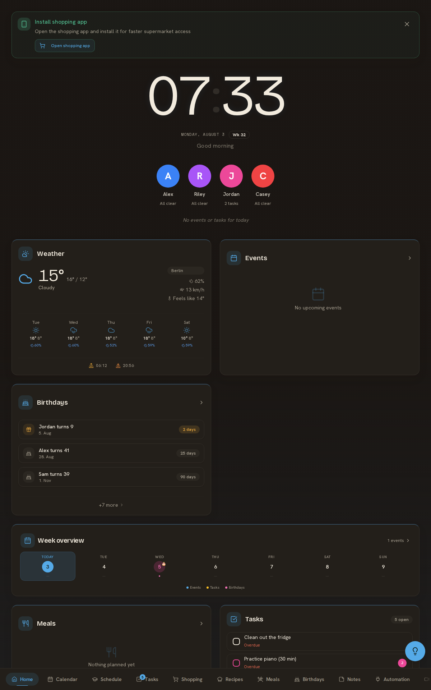

<sub>Built for kiosk-style touchscreens but works on any phone, tablet, or browser. Multi-device, multi-person, no cloud account required.</sub>

</div>

---

## Table of contents

- [Why](#why)
- [Features](#features)
- [Quick start](#quick-start)
- [Screenshots](#screenshots)
- [Integrations](#integrations)
- [Tech stack](#tech-stack)
- [Reference hardware build](#reference-hardware-build)
- [Documentation](#documentation)
- [Status & roadmap](#status--roadmap)
- [Contributing](#contributing)
- [Support development](#support-development)
- [Acknowledgements](#acknowledgements)
- [License](#license)

---

## Why

Family logistics are scattered across calendars, chat threads, sticky notes, and "did you check the shopping list?" Kinboard consolidates the daily-driver stuff into one always-on display, so the family knows what's happening without opening apps.

- **Self-hosted.** Your data stays on your hardware. No SaaS, no telemetry, no account gating.
- **Real-time.** Edit a shopping item on your phone, it appears on the kitchen wall in milliseconds (Supabase Realtime over WebSockets).
- **Offline-tolerant.** The shopping list works in the basement supermarket without signal — changes queue locally and replay when the device gets connectivity back.
- **Touch-friendly.** Designed for wall-mounted tablets first; mobile and desktop are first-class too.
- **Modular.** Pick the integrations you actually use; the rest stay invisible.

---

## Features

| Feature | Wiki page |
|---|---|
| **Dashboard** — clock, today strip, configurable widget grid | [Dashboard](docs/wiki/Dashboard.md) |
| **Calendar** — two-way Google Calendar sync, per-person colors, holidays, waste-pickup widgets | [Calendar](docs/wiki/Calendar.md) |
| **Shopping list** — built-in real-time list with **offline support** + dedicated standalone PWA, optional Bring! sync | [Shopping](docs/wiki/Shopping.md) |
| **Recipes & meal planning** — Chefkoch.de search + schema.org URL import, weekly meal board, recipe-driven shopping | [Recipes & meals](docs/wiki/Recipes.md) |
| **Tasks & todos** — per-person assignment, priorities, daily reminder push | [Tasks & todos](docs/wiki/Tasks.md) |
| **Notes** — quick shared sticky notes for the household | [Notes](docs/wiki/Notes.md) |
| **Birthdays** — year-ring viz, countdowns, gift-idea tracking | [Birthdays](docs/wiki/Birthdays.md) |
| **School schedule** — per-child timetable + auto pack list for tomorrow | [Schedule](docs/wiki/Schedule.md) |
| **Smart home** — Home Assistant entities, room tabs, floating-lights master control | [Smart home](docs/wiki/Smart-Home.md) |
| **Energy dashboard** — solar / battery / grid live flow + charts | [Smart home → Energy](docs/wiki/Smart-Home.md#energy) |
| **Cameras** — live WebRTC streams (via go2rtc) | [Cameras](docs/wiki/Cameras.md) |
| **Photo screensaver** — Immich monthly album or Unsplash fallback, presence-aware blanking | [Screensaver](docs/wiki/Screensaver.md) |
| **Weather** — current + hourly + radar (OpenWeatherMap) | [OpenWeatherMap](docs/wiki/OpenWeatherMap.md) |
| **Web push notifications** — shopping items, task assignments, daily todo digest. **PWA install** required on iOS. | [Notifications](docs/wiki/Notifications.md) |
| **Multi-device + multi-person** — devices join a family with a 6-char code, per-person color coding everywhere | [Family members](docs/wiki/Family-Members.md), [Devices](docs/wiki/Devices.md) |
| **Monthly themes** — colors shift through the year automatically | [Themes & locales](docs/wiki/Themes.md) |
| **i18n** — English + German, full UI parity | [Themes & locales](docs/wiki/Themes.md) |

The full wiki has a page for every feature plus integration setup, kiosk hardware reference build, security model, and database schema.

---

## Quick start

You need **Docker** (with Compose v2), **Node.js 20+** (for the VAPID key generator that powers push notifications — `setup.sh` uses `npx`; if Node.js is missing, setup completes but push notifications stay disabled), ~2 GB free disk, and ~10 minutes. The bundled `docker-compose.yml` brings up the Next.js app, a self-hosted Supabase stack, and supporting services.

> **RAM**: the local Next.js build peaks around **4 GB**, plus another ~3-4 GB during type-check and static-page generation. On a 4 GB VM you'll need **≥ 8 GB total swap** to avoid OOM kills during build (`fallocate -l 8G /swapfile && chmod 600 /swapfile && mkswap /swapfile && swapon /swapfile`). Or — recommended — skip the build entirely by using the pre-built image at [`docker-compose.image.yml`](webapp/docker/docker-compose.image.yml). That drops bring-up to ~30 sec and needs only ~512 MB at runtime.

If you don't have Docker yet:

```bash
curl -fsSL https://get.docker.com | sh
```

Then bring Kinboard up:

```bash
git clone https://github.com/svenger87/kinboard.git
cd kinboard
./setup.sh                # generate random secrets + Supabase JWT keys
cd webapp/docker
./start.sh up             # docker compose up -d
```

Open `http://<server-ip>:3001` (or `http://localhost:3001` if local), follow the setup wizard to create your first family, and start adding integrations from `/settings`.

> **Push notifications** require Node.js for VAPID key generation. If `node` isn't on PATH when `setup.sh` runs, push stays disabled (everything else works); install Node.js + re-run `./setup.sh --force` later to enable.

> **Skip the local build** by using the pre-built multi-arch image (amd64 + arm64) at `ghcr.io/svenger87/kinboard:latest`. Drops bring-up to ~30 sec and ~512 MB RAM at runtime instead of 4 GB+ during build. See [`webapp/docker/docker-compose.image.yml`](webapp/docker/docker-compose.image.yml) for the overlay.

### Updating

`./start.sh up` reuses the cached image — fast for restarts but won't pick up new code. After pulling source updates, use:

```bash
git pull
cd webapp/docker
./start.sh restart    # rebuilds the webapp image + recreates webapp + cron
```

For production self-hosting (Traefik + custom domain + backups + updates), see [Self-hosting](docs/wiki/Self-hosting.md).

---

## Screenshots

A few highlights from the [demo data set](docs/wiki/screenshots/) — see the [wiki](docs/wiki/) for the per-feature pages.

<table>
  <tr>
    <td align="center"><a href="docs/wiki/images/calendar-month-view.png">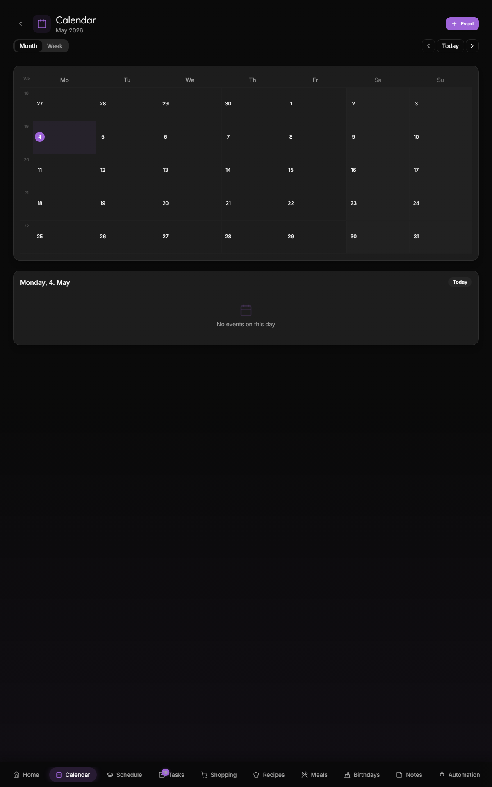</a><br/><sub>Calendar</sub></td>
    <td align="center"><a href="docs/wiki/images/energy-flow-diagram.png">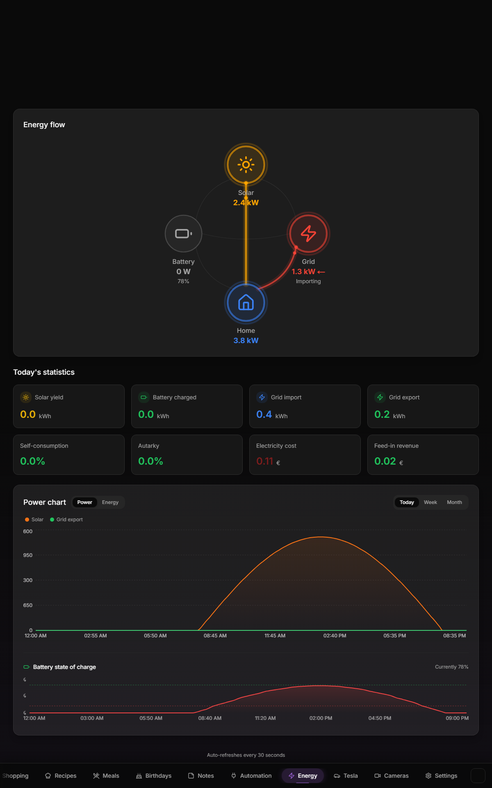</a><br/><sub>Energy dashboard</sub></td>
    <td align="center"><a href="docs/wiki/images/home-automation-rooms.png">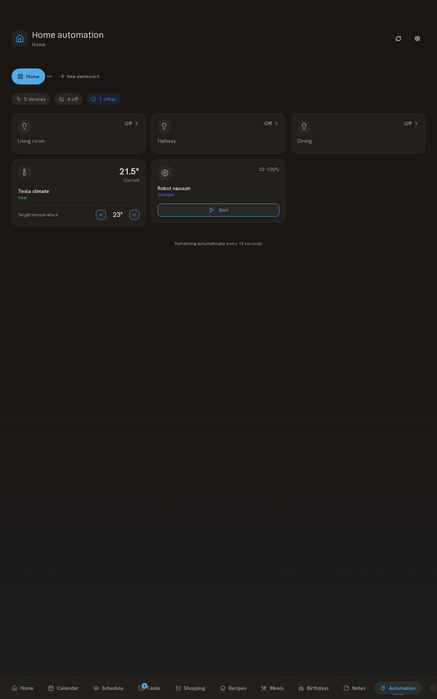</a><br/><sub>Home automation</sub></td>
  </tr>
  <tr>
    <td align="center"><a href="docs/wiki/images/shopping-list-mixed.png">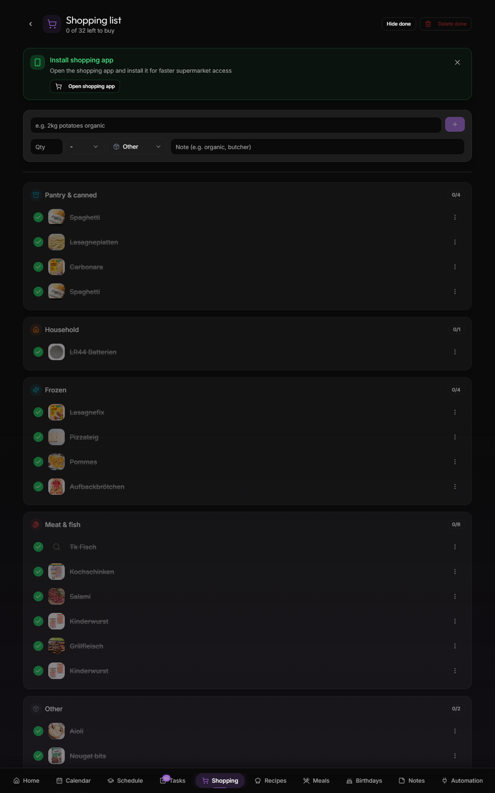</a><br/><sub>Shopping</sub></td>
    <td align="center"><a href="docs/wiki/images/birthdays-year-ring.png">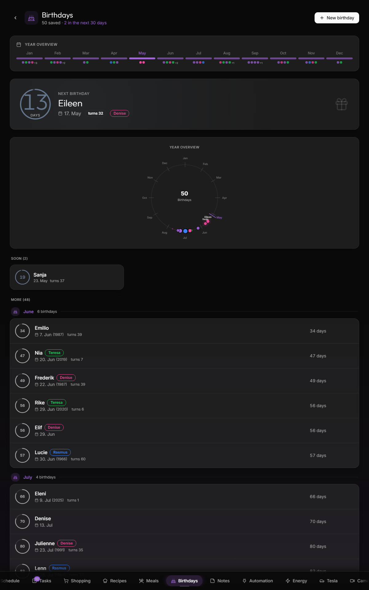</a><br/><sub>Birthdays</sub></td>
    <td align="center"><a href="docs/wiki/images/recipes-library.png">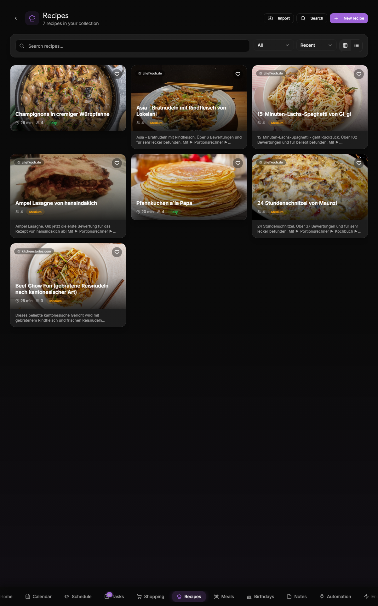</a><br/><sub>Recipes</sub></td>
  </tr>
  <tr>
    <td align="center"><a href="docs/wiki/images/meals-week-board.png">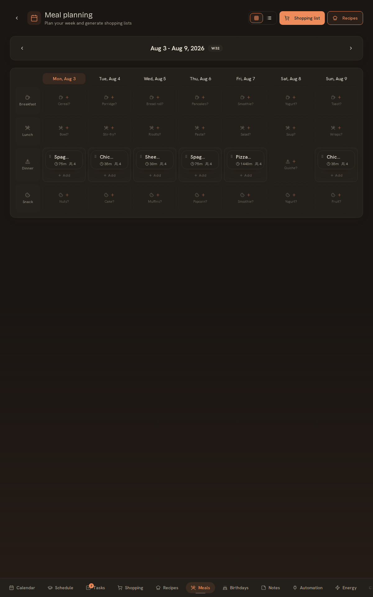</a><br/><sub>Meal planning</sub></td>
    <td align="center"><a href="docs/wiki/images/schedule-week-grid.png">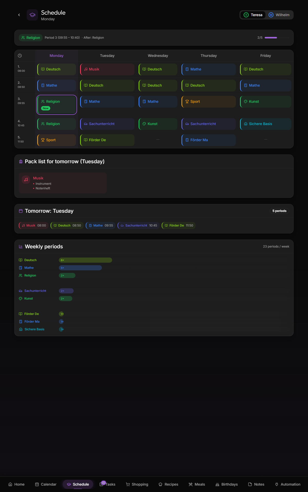</a><br/><sub>School schedule</sub></td>
    <td align="center"><a href="docs/wiki/images/todos-overview.png">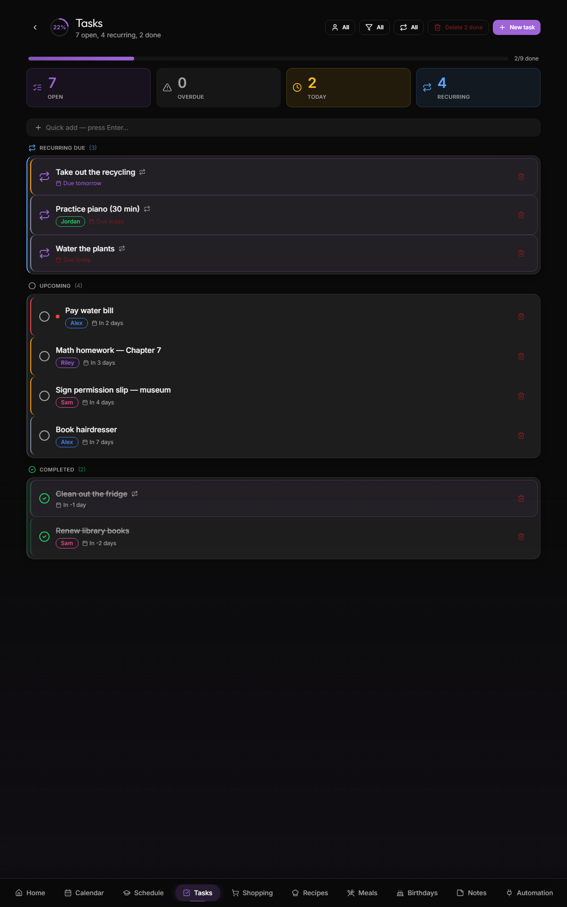</a><br/><sub>Tasks & todos</sub></td>
  </tr>
</table>

A light-mode variant of every screenshot is available with `-light` suffix (e.g. `dashboard-portrait-light.png`), and a phone-viewport variant lives in `docs/wiki/images/mobile/`. The full toolchain that produces them — local docker stack with anonymized prod data + mock HA / Tesla / OpenWeatherMap servers + Playwright capture — lives in [`docs/wiki/screenshots/`](docs/wiki/screenshots/).

---

## Integrations

| Service | Purpose | Required? |
| --- | --- | --- |
| Supabase (self-hosted) | Database + realtime sync | Yes (bundled) |
| OpenWeatherMap | Weather forecasts + radar | Optional, free tier OK |
| Google Calendar | Two-way calendar sync | Optional |
| Immich | Photo screensaver and gallery | Optional |
| Home Assistant | Smart-home entities and energy | Optional |
| Bring! | Shopping list sync (built-in list works without it) | Optional |
| go2rtc | WebRTC camera streams | Optional |

Niche integrations (Tesla Fleet, Zendure SolarFlow batteries, etc.) ship as opt-in plugins. A plugin authoring guide is in the works.

---

## Tech stack

- **[Next.js](https://nextjs.org/) 14** (App Router) + **[React](https://react.dev/) 18**
- **[shadcn/ui](https://ui.shadcn.com/)** + **[Tailwind CSS](https://tailwindcss.com/)** for UI
- **[TanStack Query](https://tanstack.com/query)** (server state) + **[Zustand](https://zustand-demo.pmnd.rs/)** (client state)
- **[Supabase](https://supabase.com/)** (Postgres + Realtime) — self-hosted
- **[next-intl](https://next-intl.dev/)** for i18n (EN + DE)
- **[Framer Motion](https://www.framer.com/motion/)** for transitions
- **Service worker + IndexedDB** for offline shopping
- **[Playwright](https://playwright.dev/)** for the screenshot capture suite

---

## Reference hardware build

Kinboard is hardware-agnostic — any HDMI display + any small PC works. For people who want a known-good combination, [Reference build](docs/wiki/Reference-Build.md) documents one ~€700 setup with a 27" capacitive touchscreen + a Mele Quieter 4C mini-PC + a custom oak frame, with a complete BOM, wiring, and what didn't work.

For software side of the kiosk install: [Windows 11 (Mele 4C)](docs/wiki/Kiosk-Windows-11-Mele-4C.md) walks through Edge `--kiosk` mode + the on-screen keyboard, and [Linux guidance](docs/wiki/Kiosk-Linux-Guidance.md) covers Cage / GNOME / X11 alternatives.

---

## Documentation

The wiki is the source of truth for everything beyond this README:

- **Getting started** — [Quick-start](docs/wiki/Quick-start.md), [Self-hosting](docs/wiki/Self-hosting.md), [Onboarding](docs/wiki/Onboarding.md)
- **Architecture** — [Architecture overview](docs/wiki/Architecture.md), [Database schema](docs/wiki/Database-Schema.md), [Security model](docs/wiki/Security-and-Threat-Model.md)
- **Built-in features** — [Dashboard](docs/wiki/Dashboard.md) · [Calendar](docs/wiki/Calendar.md) · [Shopping](docs/wiki/Shopping.md) · [Recipes & meals](docs/wiki/Recipes.md) · [Tasks](docs/wiki/Tasks.md) · [Notes](docs/wiki/Notes.md) · [Birthdays](docs/wiki/Birthdays.md) · [Schedule](docs/wiki/Schedule.md) · [Smart home](docs/wiki/Smart-Home.md) · [Screensaver](docs/wiki/Screensaver.md) · [Family members](docs/wiki/Family-Members.md) · [Devices](docs/wiki/Devices.md) · [Notifications](docs/wiki/Notifications.md) · [Themes & locales](docs/wiki/Themes.md)
- **Integrations** — [Google Calendar](docs/wiki/Google-Calendar.md) · [Home Assistant](docs/wiki/Home-Assistant.md) · [Immich](docs/wiki/Immich.md) · [Bring!](docs/wiki/Bring.md) · [OpenWeatherMap](docs/wiki/OpenWeatherMap.md) · [Cameras](docs/wiki/Cameras.md)
- **Hardware** — [Reference build (BOM + frame)](docs/wiki/Reference-Build.md) · [Windows kiosk](docs/wiki/Kiosk-Windows-11-Mele-4C.md) · [Linux guidance](docs/wiki/Kiosk-Linux-Guidance.md) · [LD2410 presence sensor](docs/wiki/Presence-Sensor.md)
- **Extending Kinboard** — [Vehicles](docs/wiki/Vehicles.md) · [Plugin architecture](docs/wiki/Plugin-Architecture.md) · [Plugin directory](docs/wiki/Plugin-Directory.md)
- **[Troubleshooting](docs/wiki/Troubleshooting.md)** — known issues + fixes

---

## Status & roadmap

**v1.0.0 shipped 2026-05-04** — first tagged public release. **Latest: [v1.0.19](https://github.com/svenger87/kinboard/releases/tag/v1.0.19) (2026-05-09).** Live demo running the latest tag at **[demo.kinboard.app](https://demo.kinboard.app)** (auto-updated via Watchtower; data resets daily). The project is single-maintainer and developed in personal time; expect periodic activity rather than a Big Co cadence. See the [`CHANGELOG`](CHANGELOG.md) for what's in each release and the [`RELEASE`](RELEASE.md) doc for how releases are cut.

**Security model:** designed for a trusted home network. Do not expose Kinboard directly to the public internet without putting a reverse proxy and authentication layer in front of it. See [Security & threat model](docs/wiki/Security-and-Threat-Model.md) and [`SECURITY.md`](SECURITY.md).

### Recently shipped
- [x] **Stonks plugin** (v1.0.19) — track stocks, ETFs, crypto, indices, and forex pairs in a watchlist with proper TradingView candle charts (1d / 1w / 1m / 3m / 1y / max timeframes). Yahoo Finance is the v1 data driver — no API key required, covers every asset class through one source. Per-ticker detail page, rotating dashboard widget, server-side TTL cache (30s spot quotes, 5min charts) so kiosk auto-refresh doesn't rate-limit. Fourth registered SurfacePlugin alongside Vehicles + Energy + Cameras
- [x] **iCalendar (.ics) feed support** (v1.0.19) — read-only calendar feeds via shared `.ics` URLs. Covers iCloud Family Sharing, Google's "secret iCal address", and most CalDAV providers in one feature. Skips the Google Cloud OAuth setup entirely for read-only use. Manual "Sync now" button + 30-min cron with ETag conditional GETs and recurring-event expansion
- [x] **Energy + Cameras migrated onto the plugin contract** (v1.0.18 + v1.0.19) — both surfaces now ship as drivers under the same `SurfacePlugin` model that Vehicles introduced. Per-family enable/disable at `/settings/plugins`. The contract is now validated on four concrete surfaces (Vehicles, Energy, Cameras, Stonks)
- [x] **Calendar event reminders via web push** (v1.0.17) — family devices subscribed to push receive a notification N minutes before each event starts (configurable on `/settings/notifications`, default 30 min). All-day events are skipped. Idempotent scheduling — multiple cron ticks scanning the same window don't double-send
- [x] **Country-aware public holidays** (v1.0.16) — DE / US / UK / NL / FR. Per-family country picker on `/settings/language`; existing families default to DE so behaviour is unchanged
- [x] Pre-built multi-arch (amd64 + arm64) Docker images on `ghcr.io` — self-hosters skip the build step
- [x] CI on every PR — ESLint + i18n bundle parity + shellcheck — plus a full E2E smoke run that boots the docker stack with mock integrations and verifies the dashboard against Playwright
- [x] Public live demo at [demo.kinboard.app](https://demo.kinboard.app) with mock Home Assistant / Tesla / weather / cameras so visitors see the full UI without configuring real integrations
- [x] Watchtower auto-update overlay + post-update cache recovery so a release rollover doesn't strand users on a broken page (no manual intervention required)
- [x] First-run setup wizard at `/setup/{people,homeassistant,weather,done}` — guides fresh self-hosters through onboarding instead of dropping them on an empty dashboard; dismissible "Finish setting up" banner on the dashboard until completed
- [x] Interactive `setup.sh` — prompts for the optional API keys most self-hosters need (OpenWeatherMap, Google Calendar OAuth, maintainer email) at first-run time, with `--non-interactive` and `--advanced` flags for automation and power users
- [x] Device recognition that survives browser/OS updates — fingerprint-history table so a Safari/Chrome bump doesn't strand the device on `/join` (v1.0.11)
- [x] **Vehicles surface + build-time plugin contract** (v1.0.12) — multi-car, multi-vendor `/vehicles` page. Tesla driver (native UI via Home Assistant Fleet) + Generic-EV driver (any car HA can talk to: VW We Connect, BMW Connected Drive, Polestar, Hyundai BlueLink, OBD2 dongles). First plugin under the `SurfacePlugin` contract. See [Plugin architecture](docs/wiki/Plugin-Architecture.md), [Vehicles](docs/wiki/Vehicles.md), and the [Plugin directory](docs/wiki/Plugin-Directory.md)
- [x] **Watchtower-safe migrations** (v1.0.12) — schema migrations are now baked into the webapp Docker image and applied automatically on container start. Watchtower-driven self-hoster updates pick up new schema without anyone running `start.sh migrate` from the host

### Up next (no fixed dates)
- [ ] Additional Stonks data drivers — paid sources like Polygon or Tiingo for users wanting higher-resolution intraday + cleaner symbol coverage than Yahoo's unofficial endpoints. The driver contract already leaves room; only API-key plumbing and a settings UI need to land
- [ ] News feed per ticker on the Stonks detail page — Yahoo already returns it via `quoteSummary`, just needs UI
- [ ] Per-ticker price alerts via the existing notification queue
- [ ] Drag-reorder for the Stonks watchlist (currently creation-order)
- [ ] Additional locales beyond EN + DE (community PRs welcome — see [`CONTRIBUTING.md`](CONTRIBUTING.md#translations))

---

## Contributing

Bug reports, feature requests, translations, and code PRs all welcome. The full guide lives in [`CONTRIBUTING.md`](CONTRIBUTING.md) — it covers dev setup, code conventions, the changelog discipline, and the Conventional Commits format. For where to take questions vs. issues vs. discussions, see [`SUPPORT.md`](SUPPORT.md).

Quick orientation:

- **Bugs** — [open an issue](https://github.com/svenger87/kinboard/issues/new?template=bug_report.yml) with logs + the route that broke
- **Features** — open a [GitHub Discussion](https://github.com/svenger87/kinboard/discussions) before a substantial PR
- **Translations** — `webapp/messages/*.json` is the source of truth; PRs adding new locales (FR, ES, IT, NL…) gladly accepted
- **Plugins** — the plugin system isn't carved in stone yet; open a discussion to help shape it
- **Security** — see [`SECURITY.md`](SECURITY.md) — please don't file public issues for credential / data-access vulnerabilities

CI runs ESLint + i18n bundle parity + shellcheck on every PR. The codebase deliberately doesn't run `next build` in CI to keep the dev-server experience predictable; production builds happen in the Docker image workflow.

---

## Support development

Kinboard is built and maintained on personal time. If it's useful to your family and you'd like to keep it healthy:

- **GitHub Sponsors** (recurring) → [github.com/sponsors/svenger87](https://github.com/sponsors/svenger87)
- **Buy Me a Coffee** (one-time tip) → [buymeacoffee.com/sven.7687](https://buymeacoffee.com/sven.7687)
- **Star the repo** — helps others find it
- **Contribute** — bug reports, plugins, translations all welcome
- **Re-run screenshots** — the capture suite is in [`docs/wiki/screenshots/`](docs/wiki/screenshots/) and runs end-to-end against an anonymized demo

[](https://github.com/sponsors/svenger87)
[](https://buymeacoffee.com/sven.7687)

---

## Acknowledgements

Kinboard stands on the shoulders of an incredible amount of open-source work:

- **[Supabase](https://supabase.com/)** — the entire self-hosted backend stack (Postgres, Realtime, GoTrue, PostgREST, Storage)
- **[Next.js](https://nextjs.org/)** + **[Vercel](https://vercel.com/)** — the application framework
- **[shadcn/ui](https://ui.shadcn.com/)** — the component primitives. UI quality starts here.
- **[Lucide](https://lucide.dev/)** — every icon in the app
- **[Framer Motion](https://www.framer.com/motion/)** — the smooth, deliberate transitions
- **[next-intl](https://next-intl.dev/)** — i18n done right for App Router
- **[Home Assistant](https://www.home-assistant.io/)** — the smart-home backbone Kinboard talks to
- **[Immich](https://immich.app/)** — the photo backend that powers the screensaver
- **[Bring!](https://www.getbring.com/)** — the shopping list app some of us still want on a phone
- **[go2rtc](https://github.com/AlexxIT/go2rtc)** — the camera streaming bridge
- **[OpenWeatherMap](https://openweathermap.org/)** — weather data
- **[Chefkoch.de](https://www.chefkoch.de/)** — recipe search source
- **[Faker](https://fakerjs.dev/)** — anonymized demo data for the screenshot toolchain
- **[Playwright](https://playwright.dev/)** — automated screenshot capture

For the specific kiosk hardware combination (display + mini-PC + frame), see [Reference build](docs/wiki/Reference-Build.md).

---

## License

MIT — see [`LICENSE`](LICENSE).
