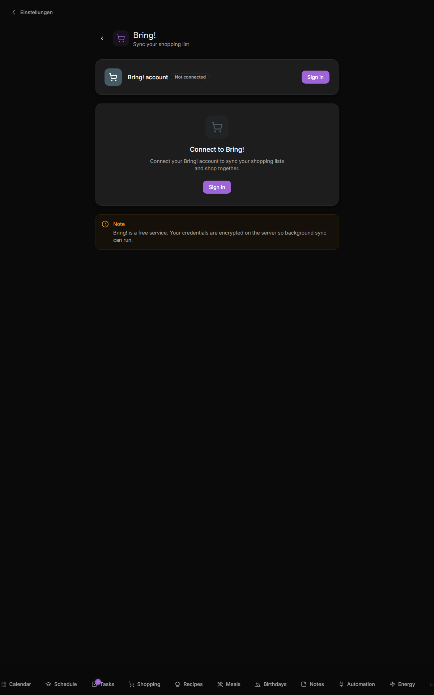

# Bring! shopping list

Two-way sync between Kinboard's shopping list and the [Bring!](https://www.getbring.com/) mobile app, so the kitchen-wall list stays in sync with what someone updates from the supermarket.

> TODO: shot showing the Bring sync indicator badge in the page header

## What it does

- Logs into your Bring! account with email + password
- Lists your Bring! lists; you pick the active one
- Auto-syncs every 2 minutes (configurable)
- Two-way: items added in Kinboard appear in Bring!, and vice versa
- Optionally syncs Bring's category labels back into Kinboard

## What it does not

- Doesn't sync multiple Bring! lists at once — one active list per family
- No real-time sync (poll-based)
- Doesn't sync the recipe-list integration that Bring! has

## Setup

### 1. Connect

1. Open Settings → Bring!
2. Click **Sign in**
3. Enter your Bring! email + password
4. **Sign in**

The access and refresh tokens are stored server-side only, in the `integration_secrets` table (key `bring_settings`) — never sent to the browser; only the server reads them when posting to the Bring! API. Non-secret profile fields (account email, name, default list) remain in the regular `settings` table. See [Security-and-Threat-Model → Integration credentials](Security-and-Threat-Model#integration-credentials).

### 2. Pick the active list

After connect, the dropdown shows all your Bring! lists. Pick one — that becomes Kinboard's primary shopping list.

### 3. Tweak sync settings

| Toggle | What |
|---|---|
| **Auto sync** | Poll Bring! every 2 minutes (default on) |
| **Two-way sync** | Push Kinboard changes back to Bring! (default on; turn off for one-way "Kinboard mirrors Bring!" mode) |
| **Sync categories** | Adopt Bring's category names instead of Kinboard's auto-detected ones (default on) |

## How merge conflicts resolve

The sync algorithm is "last write wins" per item:

- An item exists in both → the one with the later modification timestamp wins
- An item only on Bring! → added to Kinboard
- An item only in Kinboard → pushed to Bring!
- An item completed in one → marked completed in the other

In practice this just works for shopping lists — collisions are rare and benign.

## Disconnecting

Settings → Bring! → **Disconnect**. Local shopping list stays; just stops syncing.

## Troubleshooting

| Symptom | Likely cause |
|---|---|
| **Login failed** | Bring! sometimes rate-limits credential checks; wait 5 min. Still rejected after several correct attempts? Sign out and back in via the Bring! mobile app to confirm the credentials work, then retry |
| **Sync runs but new items don't appear** | The active list ID is stale (you deleted it in Bring!). Re-pick the list. |
| **Categories show in German when I switched to English** | The category names from Bring! are German because that's what Bring! sent. Disable **Sync categories** to use Kinboard's localized auto-detection. |
| **Kinboard's quantity (`2 × Apples`) shows as `2x Apples` in Bring!** | Bring's freeform `specification` field doesn't have a separate quantity. Kinboard packs `quantity + unit + name` into the name on push. |

## Related

- [Themes](Themes) — shopping category labels live under `shoppingCategories` in `messages/{en,de}.json`
- See [`webapp/src/lib/shopping-categories.ts`](https://github.com/svenger87/kinboard/blob/main/webapp/src/lib/shopping-categories.ts) for the keyword auto-detection
