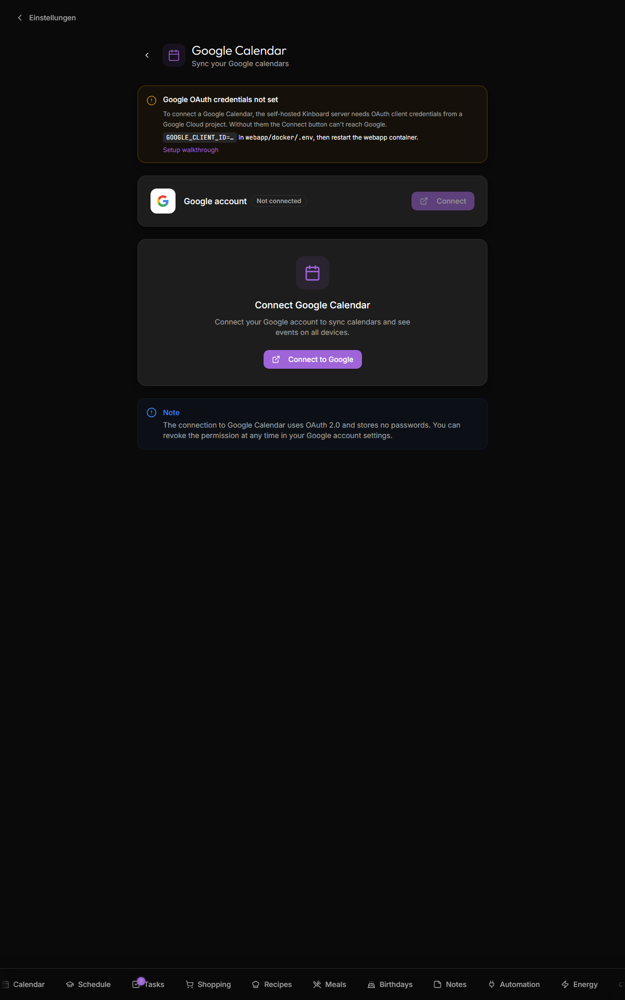

# Google Calendar

**Two-way sync** of selected Google calendars into the dashboard view. Events created or edited in Kinboard get pushed back to Google; events created in Google flow into Kinboard at the next sync interval. Per-event mapping rules let you assign events to specific family members based on title patterns.

> Not on Google? [CalDAV](CalDAV) gives you the same two-way sync against Nextcloud, Radicale, Fastmail, iCloud and friends — with a username and password instead of a Google Cloud project. The mapping rules below are shared by both providers.



## What it does

- OAuth into your Google account, list calendars, let you pick which ones to sync
- Pull events into `public.events` on a schedule (default 15 min) or on demand
- Push events created/edited/deleted in Kinboard back to the chosen Google calendar
- Assign events to specific people via mapping rules ("starts with `Emma:`" → assign to Emma)
- Show holidays + waste-collection calendars distinctly (badges per type)

## What it does not

- Doesn't write to Google calendars Google itself marks read-only (subscribed public calendars, calendars shared to you with view-only permission). Those round-trip is suppressed; you'll see an error toast if you try.
- Doesn't sync attendees, attachments, or recurring-event exceptions beyond the basics.
- Doesn't dedupe across overlapping subscribed calendars (if two of your enabled calendars include the same event, it shows twice).

## Setup

### 1. Create a Google Cloud OAuth client

You need a project with the Google Calendar API enabled. The free tier is plenty.

1. Open https://console.cloud.google.com/projectcreate
2. Create a project named `kinboard` (or whatever).
3. Enable the **Google Calendar API**: APIs & Services → Library → search "Google Calendar API" → Enable.
4. Create OAuth credentials: APIs & Services → Credentials → Create Credentials → **OAuth client ID** → Application type **Web application**.
5. Authorized redirect URI:
   - `http://localhost:3001/api/google/callback` for local dev
   - `https://<your-domain>/api/google/callback` for production (your Kinboard URL)
6. Save the **Client ID** and **Client secret**.

### 2. Add to webapp/docker/.env

```
GOOGLE_CLIENT_ID=<paste from Cloud Console>
GOOGLE_CLIENT_SECRET=<paste from Cloud Console>
GOOGLE_REDIRECT_URI=https://<your-domain>/api/google/callback
```

Restart the webapp:

```bash
cd webapp/docker
./start.sh restart
```

### 3. Connect from the app

1. Open Settings → Google Calendar
2. Click **Connect**
3. Sign in to Google in the popup, grant calendar read access
4. Pick which calendars to sync (toggle them on)
5. Optional: assign each calendar to a specific person (the per-row "Person" select)
6. Optional: mark a calendar as a **holidays calendar** (party-popper icon) or **waste-pickup calendar** (recycle icon) — these get special widget treatment

### 4. Verify

The Settings page shows **Last sync**. Click **Sync now** to trigger an immediate fetch. New events appear on the dashboard within a few seconds.


## Mapping rules

If you have a single shared family calendar but want events auto-assigned to people based on title patterns, use mapping rules:

| Match type | Example | What it matches |
|---|---|---|
| `contains` | `Emma` | Any event title containing "Emma" (case-sensitive substring) |
| `starts_with` | `Mama:` | Title begins with "Mama:" |
| `ends_with` | `(Papa)` | Title ends with "(Papa)" |
| `regex` | `^[A-Z][a-z]+ —` | Custom regex |

Rules are evaluated in priority order; first match wins. Higher-priority rules override lower. Test rules with the **Test** button — it runs them against the next 30 days of synced events and shows which person each would be assigned to.

## Auto-sync

Enable the **Automatic synchronization** toggle to have the cron container poll Google every 15 minutes. Configured in `webapp/docker/ofelia.ini`. When auto-sync errors (token expired, network blip, etc.), the badge on the Settings page surfaces it.

## Disconnecting

Settings → Google Calendar → **Disconnect**. Local synced events stay in the database; they just stop being refreshed. To remove the synced events too, delete the calendar rows in `/settings/google` first.

The OAuth tokens — stored server-side only in `integration_secrets`, not the anon-readable `settings` table (see [Security-and-Threat-Model](Security-and-Threat-Model#integration-credentials)) — are deleted on disconnect.

## Troubleshooting

| Symptom | Likely cause |
|---|---|
| **"Connection failed"** in the OAuth popup | Redirect URI mismatch — must match exactly, including `http`/`https` and port |
| **No calendars listed** after connect | API not enabled in Cloud Console; or your account has zero calendars |
| **`/api/google/callback` 500 error** | `GOOGLE_REDIRECT_URI` env var doesn't match the one in Cloud Console |
| **Auto-sync stops after 6 months** | Google's refresh tokens expire if unused. Click **Sync now** once to refresh, or revoke + reconnect |
| **"Reconnect" banner appears, sync stopped** | Google rejected the stored authorization (`invalid_grant` — consent revoked, password changed, or the refresh token expired from long disuse). Click **Reconnect** in Settings → Google Calendar to re-authorize; the banner clears automatically on the next successful sync. |

## Related

- [Architecture](Architecture#database-schema) — `calendars` and `events` tables
- [Notifications](Notifications) — event-based calendar reminders
