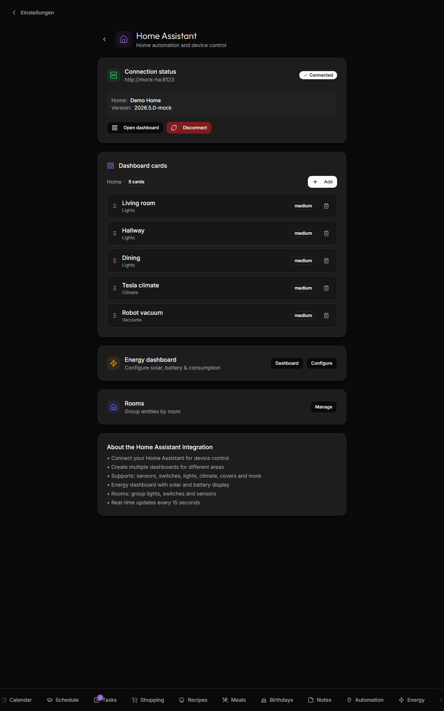
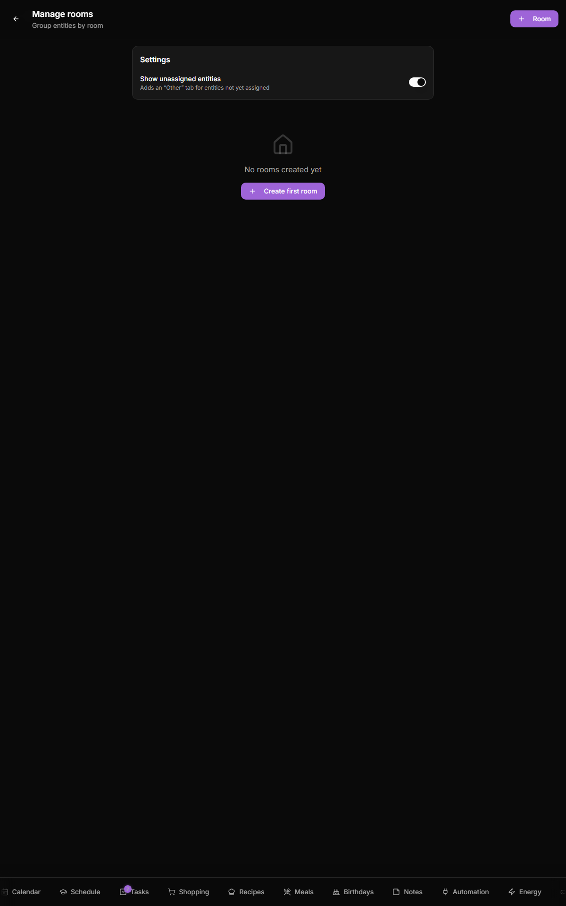

# Home Assistant

Kinboard talks to Home Assistant via its REST + WebSocket API to display entities, run room-based dashboards, and power the energy widget.

## What it does

- Browse all your HA entities, group them into Kinboard "Rooms" + "Dashboards"
- Real-time entity state (lights, switches, sensors, climate, covers, locks, alarms, media players, scenes, vacuums, weather, person trackers)
- Cards per entity domain with appropriate controls (slider for lights, set-point for climate, etc.)
- Dedicated **energy dashboard** wiring solar / battery / grid / home-consumption sensors → live power flow, charts, daily/weekly/monthly aggregates

## What it does not

- Doesn't replace the HA UI — it surfaces a curated, family-friendly subset
- Doesn't store entity history — that lives in HA itself, queried via REST when needed
- No automations / scripts / blueprints UI

## Setup

### 1. Generate a long-lived access token in HA

In Home Assistant: your profile (bottom-left avatar) → **Long-Lived Access Tokens** → **Create Token**. Name it `kinboard` and copy the token — you only see it once.

### 2. Connect from Kinboard

1. Open Settings → Home Assistant
2. **Home Assistant URL** — the URL your browser uses to reach HA. If both Kinboard and HA are on the same LAN: `http://<ha-ip>:8123`. If HA is behind your reverse proxy: `https://homeassistant.example.com`.
3. **Long-Lived Access Token** — paste the value
4. Click **Connect**. The app verifies the URL + token, then saves.

### 3. Configure dashboards

A **dashboard** is a curated grid of entity cards. Kinboard auto-creates a default one on first connect. To customize:

- Settings → Home Assistant → **Add** (next to the dashboard selector)
- Browse / search HA entities; tap to add. Each card uses the appropriate domain control.
- Reorder by dragging the grip handle.

### 4. Configure rooms

Rooms group entities for the touch-friendly room view at `/home-automation`:

- Settings → Home Assistant → **Manage** (next to Rooms)
- Create a room (name + icon + optional color)
- Tap **Add entities** on each room card and pick the relevant lights / switches / sensors

### 5. Optional: configure the energy dashboard

If you have solar / battery / grid sensors in HA, Kinboard can render a live energy-flow diagram + 24h / 7d / 30d / 1y charts:

- Settings → Home Assistant → **Configure** (next to Energy)
- Map your power-W and energy-kWh sensors to the slots: Solar, Battery (charge/discharge), Grid (import/export), Home consumption
- Set tariffs per kWh for cost calculations
- Toggle **Show on screensaver** if you want the screensaver to surface live solar production

The energy backend uses HA's `/api/history/period` and `/api/statistics` endpoints; all aggregation happens in Kinboard, not in HA.

## Entity domain support

Each entity domain renders with an appropriate card — slider for lights, set-point for climate, PIN keypad for alarms, and so on. Full domain-to-card reference: [Smart-Home → Cards](Smart-Home#cards).

## Disconnecting

Settings → Home Assistant → **Disconnect**. All configured dashboards, rooms, and the energy config stay in the database (so you can reconnect later without redoing the work).

## Troubleshooting

| Symptom | Likely cause |
|---|---|
| **"Connection failed"** | URL or token wrong, or HA's `cors_allowed_origins` rejects the origin (HA defaults are open enough for Kinboard, but tighten and you'll need to add the Kinboard origin). Also check mixed content (Kinboard on HTTPS, HA on plain HTTP — browsers block that) and token revocation — if the HA user was deleted, the token dies with it; Settings → Home Assistant shows a **Reconnect** banner in that case, paste a fresh long-lived token. |
| **State updates lag by 30s** | Kinboard uses 15 s polling for entities not on its WebSocket subscription list. If you need real-time on a specific sensor, add it to a dashboard card (those subscribe). |
| **Energy chart is blank** | Sensors not yet configured — visit `/settings/homeassistant/energy` and wire them up. Chart needs at least 24h of history. |
| **Token works in HA UI but fails here** | Long-lived tokens have a 10-year expiry; not the issue. More likely: URL must match exactly (`https://` vs `http://`, trailing slash, port). |

## Related

- [Cameras](Cameras) — cameras direct to go2rtc, bypassing HA
- [Themes](Themes) — entity-state strings localize via `homeAutomation.entityState.*`
