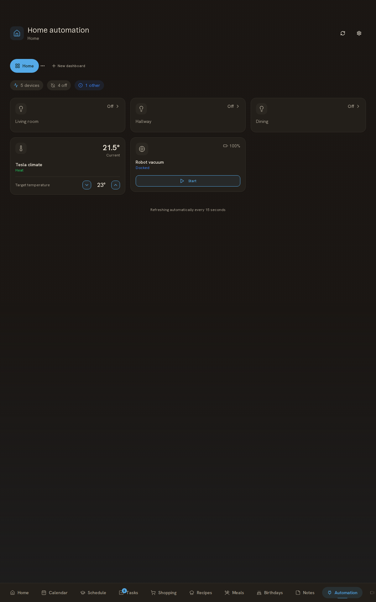
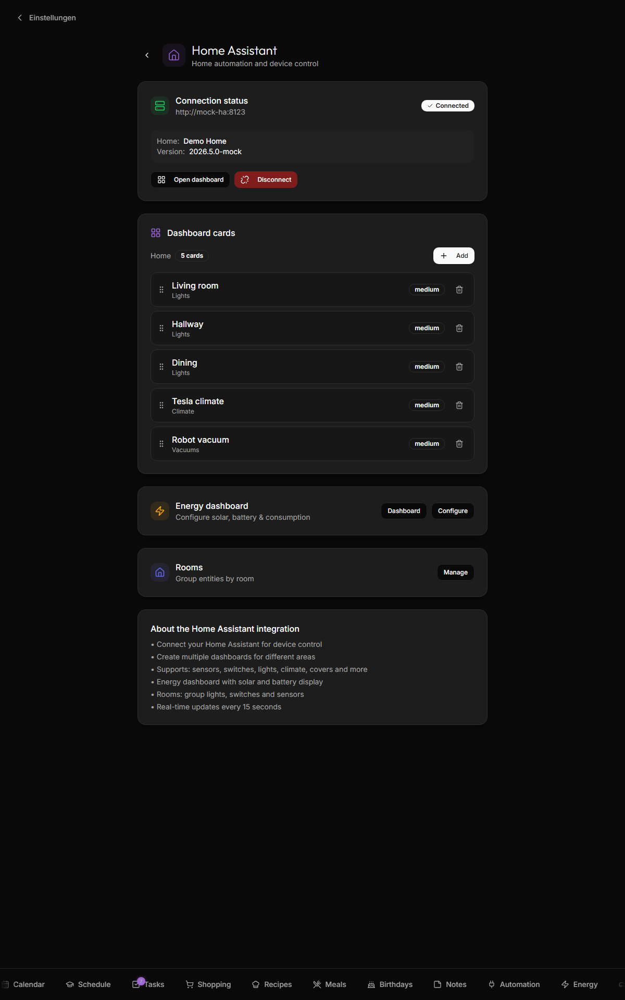
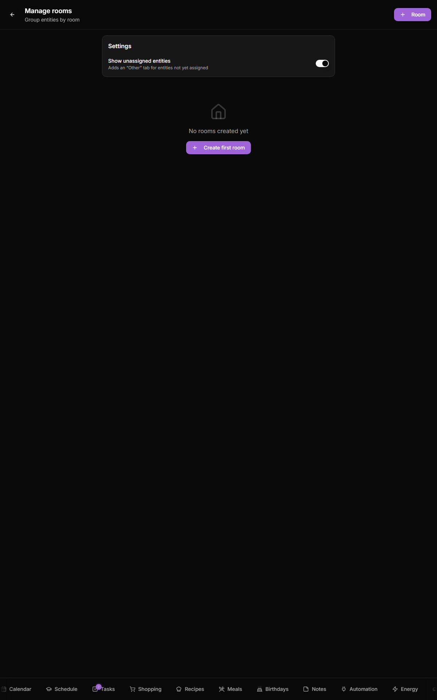
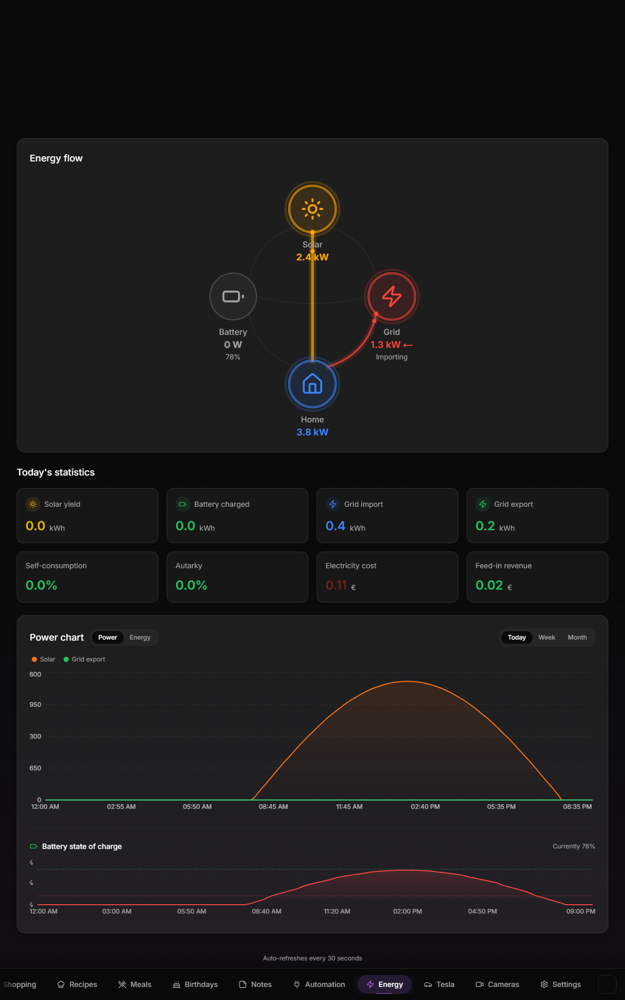

# Home Assistant

Kinboard talks to Home Assistant via its REST + WebSocket API to display entities, run room-based dashboards, and power the energy widget.



## What it does

- Browse all your HA entities, group them into Kinboard "Rooms" + "Dashboards"
- Real-time entity state (lights, switches, sensors, climate, covers, locks, alarms, media players, scenes, vacuums, weather, person trackers)
- Cards per entity domain with appropriate controls (slider for lights, set-point for climate, etc.)
- Dedicated **energy dashboard** wiring solar / battery / grid / home-consumption sensors → live power flow, charts, daily/weekly/monthly aggregates

## What it does not

- Doesn't replace the HA UI — it surfaces a curated, family-friendly subset
- Doesn't store entity history — that lives in HA itself, queried via REST when needed
- No automations / scripts / blueprints UI

## Setup

### 1. Generate a long-lived access token in HA

In Home Assistant: your profile (bottom-left avatar) → **Long-Lived Access Tokens** → **Create Token**. Name it `kinboard` and copy the token — you only see it once.

### 2. Connect from Kinboard

1. Open Settings → Home Assistant
2. **Home Assistant URL** — the URL your browser uses to reach HA. If both Kinboard and HA are on the same LAN: `http://<ha-ip>:8123`. If HA is behind your reverse proxy: `https://homeassistant.example.com`.
3. **Long-Lived Access Token** — paste the value
4. Click **Connect**. The app verifies the URL + token, then saves.



### 3. Configure dashboards

A **dashboard** is a curated grid of entity cards. Kinboard auto-creates a default one on first connect. To customize:

- Settings → Home Assistant → **Add** (next to the dashboard selector)
- Browse / search HA entities; tap to add. Each card uses the appropriate domain control.
- Reorder by dragging the grip handle.

### 4. Configure rooms

Rooms group entities for the touch-friendly room view at `/home-automation`:

- Settings → Home Assistant → **Manage** (next to Rooms)
- Create a room (name + icon + optional color)
- Tap **Add entities** on each room card and pick the relevant lights / switches / sensors



### 5. Optional: configure the energy dashboard

If you have solar / battery / grid sensors in HA, Kinboard can render a live energy-flow diagram + 24h / 7d / 30d / 1y charts:

- Settings → Home Assistant → **Configure** (next to Energy)
- Map your power-W and energy-kWh sensors to the slots: Solar, Battery (charge/discharge), Grid (import/export), Home consumption
- Set tariffs per kWh for cost calculations
- Toggle **Show on screensaver** if you want the screensaver to surface live solar production



The energy backend uses HA's `/api/history/period` and `/api/statistics` endpoints; all aggregation happens in Kinboard, not in HA.

## Entity domain support

Each entity domain renders with an appropriate card — slider for lights, set-point for climate, PIN keypad for alarms, and so on. Full domain-to-card reference: [Smart-Home → Cards](Smart-Home#cards).

## Disconnecting

Settings → Home Assistant → **Disconnect**. All configured dashboards, rooms, and the energy config stay in the database (so you can reconnect later without redoing the work).

## Troubleshooting

| Symptom | Likely cause |
|---|---|
| **"Connection failed"** | URL or token wrong, or HA's `cors_allowed_origins` rejects the origin (HA defaults are open enough for Kinboard, but tighten and you'll need to add the Kinboard origin). Also check mixed content (Kinboard on HTTPS, HA on plain HTTP — browsers block that) and token revocation — if the HA user was deleted, the token dies with it; Settings → Home Assistant shows a **Reconnect** banner in that case, paste a fresh long-lived token. |
| **State updates lag by 30s** | Kinboard uses 15 s polling for entities not on its WebSocket subscription list. If you need real-time on a specific sensor, add it to a dashboard card (those subscribe). |
| **Energy chart is blank** | Sensors not yet configured — visit `/settings/homeassistant/energy` and wire them up. Chart needs at least 24h of history. |
| **Token works in HA UI but fails here** | Long-lived tokens have a 10-year expiry; not the issue. More likely: URL must match exactly (`https://` vs `http://`, trailing slash, port). |

## Related

- [Cameras](Cameras) — cameras direct to go2rtc, bypassing HA
- [Themes](Themes) — entity-state strings localize via `homeAutomation.entityState.*`

---

# The other direction: Kinboard in Home Assistant

Everything above is Kinboard *reading* Home Assistant — lights, sensors and
cameras on the kitchen display.

Since **1.9.0** it also works the other way. A separate Home Assistant
integration publishes what the family has on today as Home Assistant entities,
so an automation can react to a birthday, an overdue task, or the shopping
list, and can put something on that list in return.

The integration lives in its own repository:
**[svenger87/kinboard-homeassistant](https://github.com/svenger87/kinboard-homeassistant)**.

## Create a token

**Settings → Integrations → New token.** Name it (the name is only so you can
tell two apart later), tick what it may do, and copy it — **it is shown once**.
Kinboard stores only a fingerprint and cannot show it again.

Nothing is granted by default and **no permission implies another**: a token
that may add shopping items cannot create tasks, and a read-only token cannot
write at all.

| Scope | Needed for |
|---|---|
| `family:read` | every sensor and the calendar — the minimum |
| `events:read` | Kinboard events on the Home Assistant bus |
| `shopping:write` | the shopping to-do list |
| `tasks:write` | the task to-do list, and the `create_task`, `add_pocket_money` and `dismiss_attention` actions |
| `notes:write` | creating notes |
| `announcements:write` | a camera on the wall displays (`show_camera`, below) |

Every other permission on that page exists for AI assistants connected
through Kinboard's built-in MCP endpoint — reading notes, writing the calendar,
the meal plan and birthdays, timers, energy, cars, controlling catalogue
devices, pocket money and more. Home Assistant needs none of them. What each
one grants is listed under
[AI assistants: permissions and safety](AI-Assistants-Permissions-and-Safety#permissions).

A token can be revoked on its own, at any time, without disturbing the others.
Revoking keeps the row so you can still see what it was and when it was last
used — which is exactly what you want to know *after* revoking something.

## What Home Assistant gets

- **Sensors** — the next appointment, whose birthday is next, which children
  have school tomorrow (nobody during school holidays, on public holidays outside the US, or at the weekend), what's for dinner today and tomorrow, open and overdue
  tasks, shopping items, and each child's pocket money.
- **A calendar** — `calendar.kinboard_family`, including events that merely
  overlap the window being viewed, so a week's holiday appears on every day of
  it.
- **Two to-do lists** — the shopping list and tasks, both two-way. Tick an item
  in Home Assistant and it ticks here.
- **Events** on the Home Assistant bus, so an automation can trigger the moment
  a task is completed or something is added to the shopping list.

Deleting keeps each list's own meaning: a task removed from Home Assistant
lands in the [recycle bin](Recycle-Bin) and can be restored, a shopping item is
gone — the same as deleting either one inside Kinboard.

## Why the events are trustworthy

They are produced by **database triggers**, not by the API layer. Most of
Kinboard's screens write straight to the database, so events raised in the API
would have missed nearly everything a person actually does — ticking a task on
the wall tablet included. A trigger sees every write, whatever made it.

Delivery is resumable: the integration stores the id of the last event it
processed and continues from there, so restarting either system loses nothing.

## If setup fails

The error names which of four things went wrong, because they need different
fixes:

| Message | Means |
|---|---|
| Could not reach Kinboard | wrong address, or Kinboard is down. Use the address **Home Assistant** can reach — not `localhost` |
| Kinboard rejected this token | mistyped, revoked, or expired |
| This Kinboard is older than 1.9.0 | upgrade Kinboard first |
| This token cannot read family data | recreate it with at least `family:read` |

Every API response also carries a short reference that appears on each log line
for that request:

```bash
docker logs kinboard-webapp 2>&1 | grep <reference>
```

## A camera on the wall displays

When the doorbell rings, an automation can put a camera on the wall displays
for a minute — full screen, live and muted — and push it to every phone. The
displays go back to what they were showing on their own; a tap closes it sooner.

The simplest way is to pick the doorbell on the camera itself and let the
integration do the rest — see [Doorbell → camera](#doorbell--camera) below.
Without the integration, or for an automation of your own, `show_camera` can be
called directly.

It needs a token with `announcements:write`, and `family:read` to list the
cameras: `GET /api/integration/v1/cameras` returns each camera's id, name and
doorbell, and `show_camera` takes the id or the name. A `rest_command` calls it.
Every write needs its own `Idempotency-Key`, so the header is a template:

```yaml
rest_command:
  kinboard_show_camera:
    url: "https://kinboard.example/api/integration/v1/services/show_camera"
    method: post
    headers:
      authorization: !secret kinboard_token  # "Bearer <token>"
      idempotency-key: "doorbell-{{ now().timestamp() | int }}"
    content_type: application/json
    payload: '{"camera": "Front door", "duration": 60}'
```

Then add `action: rest_command.kinboard_show_camera` to the doorbell automation.

- `duration` is in seconds, 5 to 300; 60 when left out.
- The wall displays are every device set up as a kiosk. `target_devices` —
  device ids or exact names — picks others instead. Phones get the push either
  way; quiet hours apply to it.
- A second ring while it is up starts the time again.
- Five calls in ten minutes per token, then `429`, so an automation stuck in a
  loop cannot keep taking over the walls. A call answered `400` (a camera name
  with a typo, say) does not count, and neither does a retry with the same
  `Idempotency-Key`.
- If the push is still waiting to go out when the camera goes back, it is
  dropped rather than arriving late.

## Doorbell → camera

Tell Kinboard which doorbell belongs to which camera, and the Kinboard
integration for Home Assistant puts that camera on the wall displays whenever
the bell rings — no automation to write.

### In Kinboard

1. Settings → Cameras, then add a camera or edit one.
2. Under **Show on the screens when this rings**, pick the doorbell. The list
   shows Home Assistant's `binary_sensor`, `event`, `button` and
   `input_button` entities — most doorbells are a `binary_sensor` (a wired or
   Ring/Nest-style bell) or an `event` (Reolink, UniFi Protect and newer
   integrations).
3. Save. A small bell next to the camera in the list shows it has one.

Home Assistant has to be connected (Settings → Home Assistant) for the list to
fill; until it is, the field is there but greyed out. A bell belongs to one
camera: one that another camera already has is greyed out with that camera's
name. Set it to **None** to stop.

Kinboard itself never listens to Home Assistant. It only stores the pair; the
integration reads it.

### What the integration does

The integration reads the pairs from `GET /api/integration/v1/cameras`, watches
those entities, and when one rings calls `show_camera` for its camera: the wall
displays show it full screen for a minute and every phone gets a push, exactly
as described [above](#a-camera-on-the-wall-displays).

It needs:

- **integration version 1.2.0 or newer** — older versions ignore the pairing;
- a token with **`announcements:write`** ("send messages") as well as
  `family:read`. A token made before you wanted this can't be given more
  permissions; create a new one and reconfigure the integration in Home Assistant with it.

What "rings" means depends on the entity: a `binary_sensor` turning on, a new
`event`, a `button` or `input_button` being pressed.

### Without the integration

Use the `rest_command` from [A camera on the wall displays](#a-camera-on-the-wall-displays)
and trigger it from the doorbell yourself:

```yaml
automation:
  - alias: "Doorbell shows the front door camera"
    triggers:
      - trigger: state
        entity_id: binary_sensor.front_door_ding
        to: "on"
    actions:
      - action: rest_command.kinboard_show_camera
```

Leave the doorbell field on **None** in that case, or the integration (if you
add it later) and your automation would both fire.

## For other clients

The integration is one consumer of a documented API, not a special case. The
contract is `webapp/openapi/integration-v1.yaml` in this repository, checked
against the implementation on every CI run — so anything you build against it
is building against the same promises.
