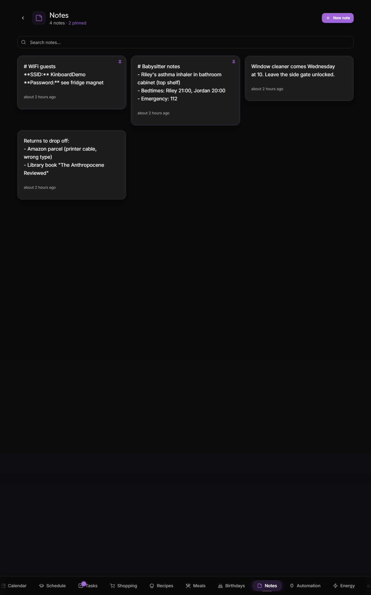

# Notes

The `/notes` page — quick shared text snippets the family wants visible.

The note widget on the dashboard surfaces the latest 3 notes, so notes work as the family's "anything you want everyone to see right now" mechanism.

## Structure

Notes are simple:

- A **title** (one line, ~80 chars)
- A **body** (multi-line, optional, supports basic markdown)
- A **color** (visual differentiation only — pink, yellow, blue, green, purple)
- A **created-by** attribution (auto-tracked)
- A **timestamp**

That's it. No tags, no folders, no categories.

## Creating

Tap **+ New note** anywhere it's offered (page header, dashboard widget). Title required, body optional. Color picker before saving.

The note is family-shared the moment you save — every device sees it within 1 s.

## Patterns that work well

- **"Where are the keys?"** — leave a note: "Keys with neighbor". Removed once you take them back.
- **"Don't forget"** — the dishwasher repair guy is coming Friday morning. Note: "Repair guy 9 AM Fri — leave back door unlocked"
- **"Package coming"** — "Package arriving Tuesday — sign for it if I'm not home"
- **Shopping list sticky notes** — quick "buy salt" type things that are too quick for the full shopping list flow
- **Wifi password card** — pin a note with the guest Wi-Fi password so visitors can see it on the kiosk

## Formatting

Body supports simple Markdown:

- `**bold**`
- `*italic*`
- `[link](https://example.com)`
- Line breaks render as line breaks (no need for double-newline)

Tables, code blocks, and images are not rendered (intentional — keeps it lightweight).

## Lifecycle

Notes don't auto-expire. Delete them manually from the note card. The widget on the dashboard shows the **most recent 3**, so newer notes naturally push older ones off-glance without requiring deletion.

## Real-time

Like everything else, real-time. Add a note on a phone → kitchen-wall dashboard widget updates within ~1 s.

## Patterns that don't work well

- **Long-form documentation.** Notes are "stickies", not docs. For documentation, use a wiki.
- **Time-sensitive reminders.** A note doesn't push a notification. Use [Tasks](Tasks.md) for that.
- **Per-person notes.** Notes are family-shared. For private memos, use your phone's notes app.

## Persistence

`public.notes` table. Real-time published. ~unlimited count per family (the dashboard widget caps to 3 visible; the page shows all).

## Related

- [Tasks](Tasks.md) — for actionable items vs. informational notes
- [Dashboard](Dashboard.md) — notes widget surfaces the latest 3
