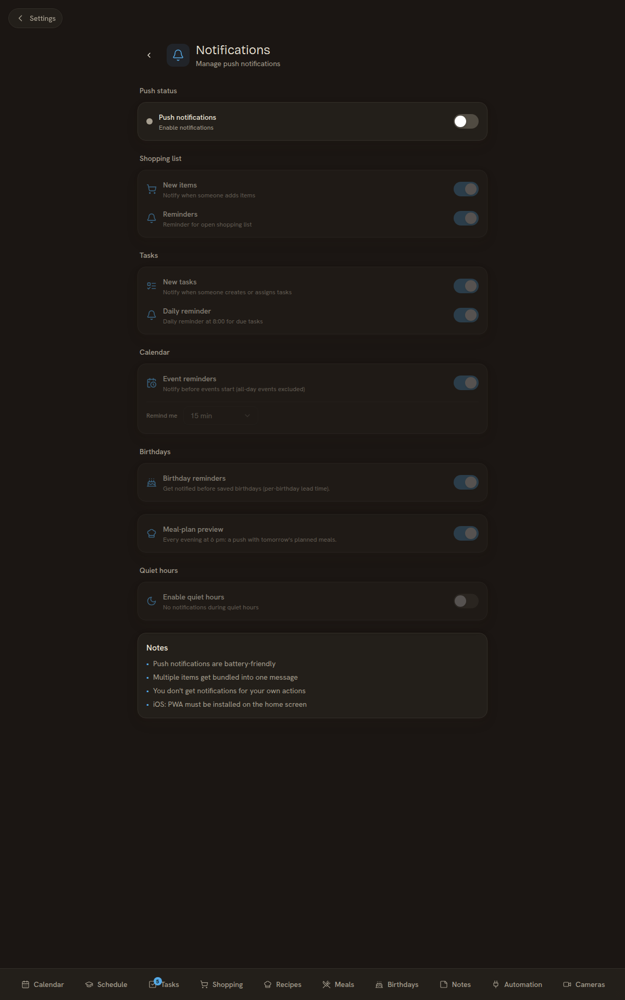

# Notifications

Kinboard supports **web push notifications** — every device that opts in gets push messages for shopping-list changes, todo deadlines, and (planned) calendar reminders.

## Requirements (read this first)

Web push has hard browser-level requirements. If any of these aren't met, the Settings → Notifications toggle won't work and you'll usually get *no* error in the UI — just silence.

- **HTTPS or `http://localhost`.** The Service Worker API and Push API only work in a [secure context](https://developer.mozilla.org/en-US/docs/Web/Security/Secure_Contexts). On a plain-HTTP LAN deployment (`http://192.168.x.x:3001`), browsers refuse to register the service worker that delivers push messages, and the PWA install prompt also won't fire. The exception `http://localhost` is a developer convenience — only the *same machine* qualifies, not phones on the LAN. To enable push on a self-host, terminate TLS in front of the webapp; the easiest path is documented in [Self-hosting → From scratch: Traefik + Let's Encrypt](Self-hosting#from-scratch-traefik--lets-encrypt). [Cloudflare Tunnel](Self-hosting#reverse-proxied-via-cloudflare-tunnel) is a no-port-forwarding alternative.
- **A modern browser.** Push API + Service Workers: Chrome 50+, Edge 17+, Firefox 44+, Safari 16.4+ (iOS 16.4+, macOS 13+ Ventura). Older Safari simply has no Push API surface — the toggle will be greyed out.
- **iOS additionally requires the PWA to be installed via Add-to-Home-Screen.** Apple delivers web push *only* to home-screen-installed PWAs, not to plain Safari tabs. Subscribing from regular Safari appears to succeed but the subscription is silently dropped — you'll never receive a push. The install flow is in the [iOS section below](#ios-safari).
- **VAPID keys must be set on the server.** Generated automatically by `setup.sh` (which runs `npx web-push generate-vapid-keys`) and written to `webapp/docker/.env` as `VAPID_PUBLIC_KEY` / `VAPID_PRIVATE_KEY`. If Node.js wasn't on PATH when you ran `setup.sh`, the keys are empty and push stays disabled — install Node.js, then run `./setup.sh --force` to regenerate.

The Notifications settings page in the app **detects the first three at runtime** and surfaces a hint card explaining the missing requirement instead of an inert toggle. Server-side VAPID readiness shows up in `/api/notifications/configured`.

## TL;DR — getting notifications working on a phone

1. **Install Kinboard as a PWA** (Add-to-Home-Screen). On iOS this is **mandatory** — Apple won't deliver web push to plain Safari, only to installed PWAs. On Android it's recommended for reliability.
2. **Open Kinboard via the home-screen icon** (not the browser bookmark).
3. Go to **Settings → Notifications**.
4. Tap **Subscribe**. Allow the permission prompt the first time.
5. Pick which event types you want pushed (shopping items, task assignments, daily todo digest).
6. (Optional) Set your quiet hours.
7. Tap **Send test** to verify a notification reaches your device.

If step 4 doesn't show the prompt, see [Troubleshooting](#troubleshooting) below.

> **Two PWAs available.** Kinboard ships *two* installable PWAs that share the same backend: the **main Kinboard PWA** (full app) and a **shopping-only PWA** scoped to the shopping list. Push subscriptions are per-origin, so both PWAs share the same notification permission and can receive any notification type. Pick whichever install fits your phone usage. See [Shopping-only PWA](#shopping-only-pwa-separate-install) below.


> TODO: screenshot of an iOS Add-to-Home-Screen flow side-by-side with the resulting subscription state

## What you can subscribe to

Per-device, in **Settings → Notifications**:

- **Shopping list — new items** ("someone added milk to the list")
- **Shopping list — reminders** ("you have 12 items still to buy")
- **Tasks — new tasks** ("Mom assigned a task to you")
- **Tasks — daily reminder** (8:00 AM digest of today's pending tasks)

Plus **Quiet hours** — a daily window during which no push is delivered (you still get the badge in-app the next morning).

## Installing as a PWA

The **PWA install** is what makes Kinboard feel like a native app on phones — and it's required for push to work on iOS. Per platform:

### iOS (Safari)

1. Open Kinboard in Safari (not Chrome — iOS Chrome is just a Safari skin and won't install)
2. Tap the **Share** button (square with up-arrow)
3. Scroll down, tap **Add to Home Screen**
4. Confirm — an icon now lives on your home screen
5. Open Kinboard from that icon (not from Safari) — it launches in standalone mode without the URL bar
6. Push subscriptions made in this standalone mode work; subscriptions made in plain Safari are silently dropped by iOS

### Android (Chrome / Edge / Firefox)

1. Open Kinboard in the browser
2. Browser usually offers an **Install app** prompt automatically — tap it
3. Or go to the browser menu → **Install app** / **Add to Home screen**
4. Confirm — icon lands on home screen
5. Push works from either the PWA or the regular browser tab on Android, but the PWA is more reliable when the browser is closed

### Desktop (Chrome / Edge)

1. Look for the install icon in the address bar (a small monitor with a down-arrow)
2. Click it → **Install**
3. The app gets its own desktop icon + opens in a chromeless window
4. Push works either way on desktop

The kiosk install on the [Mele 4C](Kiosk-Windows-11-Mele-4C) is also a Chrome PWA install — but the kiosk doesn't typically use push (it shows everything live anyway).

### Shopping-only PWA (separate install)

Kinboard also ships a **dedicated shopping-only PWA** with its own manifest (`/manifest-shopping.json`), shopping logo icon, and home-screen entry — completely separate from the main Kinboard PWA. The two coexist on the same device.

**Why it exists:** family members who do the shopping want a fast-launching phone app that opens straight to the list without nav clutter. Power-user pattern: parents who do groceries install only the shopping PWA; the kitchen kiosk + a kid's phone install the full Kinboard PWA.

**What it gives you:**

- A separate home-screen icon (shopping logo, distinct from the main Kinboard icon)
- Scoped install — opens directly to the shopping list every time, no other surfaces visible
- Its own splash screen + green theme (`#22c55e`)
- A "Quick add item" home-screen shortcut on Android (long-press the icon)
- Full offline support — service worker + IndexedDB queue for the basement-Lidl scenario

**How to install:**

When you open `/shopping` on a phone, a green install banner appears after ~2 seconds. Tap it:

- **iOS**: the banner deep-links to `/einkaufen` (the route that exposes the shopping-specific manifest), then walk through Safari Share → Add to Home Screen. The icon that lands on your home screen is the shopping logo, scoped to the shopping page only.
- **Android**: same deep-link, then accept the browser's install prompt. The browser auto-detects the scoped manifest at `/einkaufen` and installs accordingly.

> **Why the dedicated manifest is at `/einkaufen` and not `/shopping`:** historic — that's the original German URL. Both `/einkaufen` and `/shopping` render the same UI, but only the `/einkaufen` route serves the shopping-specific manifest. The install prompt automatically routes you there.

**Already installed the main PWA and want the shopping one too?** Open `/einkaufen` directly in your browser (not via the existing PWA icon), then install. Both icons coexist on the home screen.

**Notifications inside the shopping PWA:** because both PWAs share the same origin, push permission is per-origin — toggle Settings → Notifications inside *either* PWA and the subscription works for both. If you have only the shopping PWA installed and the main PWA isn't installed at all, push still works fine via the shopping PWA's service worker.

**Comparison:**

| | Main Kinboard PWA | Shopping-only PWA |
|---|---|---|
| Install from | Anywhere in Kinboard | `/einkaufen` (banner deep-links you there) |
| Manifest | `/manifest.json` | `/manifest-shopping.json` |
| Icon | Kinboard logo | Shopping logo |
| Scope | Whole app | Just the shopping page |
| Theme color | Per monthly theme | Green (`#22c55e`) |
| Push notifications | All types | All types (same origin = same permission) |
| Offline shopping | Yes | Yes |
| Best for | Daily-driver phone, kitchen kiosk, kids | "I just want the shopping list on my phone" |

For the dedicated shopping-PWA section in the shopping docs, see [Shopping](Shopping#standalone-shopping-list-pwa).

## How push works (the boring bits)

Web Push uses the [VAPID](https://datatracker.ietf.org/doc/html/rfc8292) protocol:

- The browser registers with the push service (Apple / Google / Mozilla)
- It returns an opaque endpoint URL the server can POST to
- Kinboard signs each push payload with the VAPID private key; the push service verifies and delivers
- The browser's service worker shows the notification, with sound, vibration, badge, etc.

VAPID keys are generated once per Kinboard instance via `setup.sh`:

```
NEXT_PUBLIC_VAPID_PUBLIC_KEY=<generated>
VAPID_PUBLIC_KEY=<same>
VAPID_PRIVATE_KEY=<generated>
VAPID_SUBJECT=mailto:admin@example.com
```

If you regenerate the keys, every existing subscription becomes invalid and users have to re-toggle the push subscription on each device.

## Server-side cron

Reminders that aren't event-triggered (the daily 8:00 AM todo digest, future calendar reminders) run on a schedule via the `cron` container. Configuration in `webapp/docker/ofelia.ini`:

```ini
[job-exec "todo-reminders"]
schedule = 0 0 8 * * *      # daily at 08:00
container = kinboard-webapp
command = /usr/local/bin/todo-reminders

[job-exec "process-notifications"]
schedule = @every 60s         # every minute
container = kinboard-webapp
command = /usr/local/bin/process-notifications
```

The container shells into the webapp container and `curl`s the corresponding `/api/cron/*` endpoint. Each endpoint is gated by the `Authorization: Bearer ${CRON_SECRET}` header — the `CRON_SECRET` is in the env so only a process inside the Docker network can call cron endpoints.

## iOS quirks (recap)

iOS supports web push **only** for installed PWAs (Apple's restriction, not ours). Subscriptions made in plain Safari are silently dropped by iOS. The `ShoppingInstallPrompt` component nudges iOS users toward the dedicated [Shopping-only PWA](#shopping-only-pwa-separate-install) install when they hit the shopping page; either PWA install satisfies iOS's "must be standalone" requirement and unlocks push.

Full step-by-step in [Installing as a PWA → iOS (Safari)](#ios-safari) above.

## Quiet hours

Per-device quiet window. Push notifications received during quiet hours get queued server-side and... actually, that's not implemented yet (v1.0). Currently quiet-hours-mode just suppresses delivery during the window — you don't get a digest at the end.

Roadmap for v1.1: queue-and-summarize during quiet hours.

## Testing

In `Settings → Notifications`, click **Send test** when subscribed. The webapp posts a test message via `/api/notifications/test` and you should get a "Test notification" pop on the device within ~5 seconds.

There's also a stand-alone Tkinter GUI in `tools/notification-tester.py` for end-to-end debugging. It connects to your Kinboard URL, lists subscribed devices, lets you fire arbitrary push payloads. Useful when developing new notification types.

## Disabling notifications globally

Just don't set `VAPID_*` keys in `.env`. The webapp detects missing keys and hides the Notifications settings page.

For per-family disable: each user toggles their own subscription off. There's no admin override.

## Troubleshooting

| Symptom | Likely cause |
|---|---|
| **"Not supported"** banner | Browser doesn't support Web Push (older Safari without PWA, some lockdown browsers). Try Chrome / Edge / Firefox. |
| **"Notifications blocked"** | User denied the browser permission prompt. Reset via browser site settings. |
| **Test notification doesn't arrive** | VAPID subject doesn't match the URL Kinboard runs on, OR endpoints are unreachable from the host. Check webapp logs. |
| **Notifications work in browser but not in iOS PWA** | iOS requires the **standalone display mode** to be in `manifest.json`. Kinboard's manifest is correct; verify the PWA was actually installed via Add-to-Home-Screen and not just bookmarked. |
| **Daily reminder fires twice** | The `cron` container restarted while a job was running. Idempotency is best-effort; fix is to investigate why cron restarted. |

## Related

- [Database-Schema](Database-Schema) — `push_subscriptions` and `notification_preferences` tables
- [Quick-start](Quick-start) — `setup.sh` is what generates VAPID keys for you
- See [`webapp/src/lib/push-sender.ts`](https://github.com/svenger87/kinboard/blob/main/webapp/src/lib/push-sender.ts) for the server-side push code
