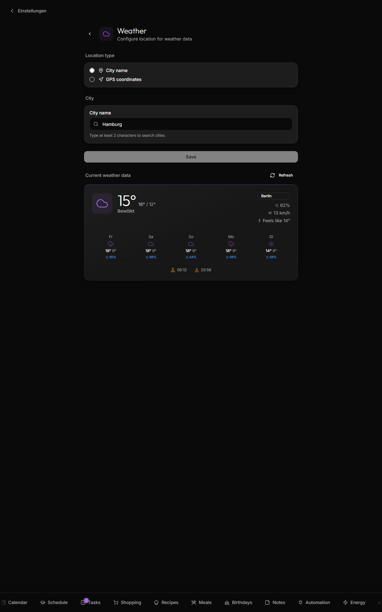

# OpenWeatherMap

Powers the weather widget on the dashboard + the full-detail weather modal (tap the widget to open it).

## What it does

- Current conditions, hourly forecast, 6-day forecast, sunrise/sunset
- City lookup by name (German + international cities) via OpenWeatherMap geocoding
- "Comfort" feels-like rating + clothing suggestion ("light jacket", "rain coat", etc.)
- Metric or imperial units, family-wide

## Units

**Settings → Weather → Units** switches the whole household between metric (°C, km/h, km, mm) and imperial (°F, mph, mi, in). The choice is stored per family, so every screen in the house agrees — it is not a per-device preference.

The setting takes effect immediately: it changes the units Kinboard asks OpenWeatherMap for, rather than converting numbers after the fact, so temperatures come back already rounded in the right system.

Two values need converting regardless of the setting, because OpenWeatherMap always reports them the same way: **visibility** is always metres, and **rainfall/snowfall** are always millimetres. Kinboard converts both. Wind is the opposite trap — metric responses are metres per second (converted to km/h for display), while imperial responses are already miles per hour and are passed through untouched.

The weather map's rain overlay is served by OpenWeatherMap as metric tiles and keeps its mm/h legend in both systems.

## Setup

### 1. Free API key

Open https://openweathermap.org/api → sign up (free) → confirm email → grab the **API key** from the dashboard.

The free tier gives you 60 calls/min and 1M calls/month, more than enough.

### 2. Add to env

`webapp/docker/.env`:

```
OPENWEATHERMAP_API_KEY=<your key>
```

Restart:

```bash
cd webapp/docker
./start.sh restart
```

> Note: This is a host-level env var, **not** per-family. If you self-host for multiple families, all families share the key.

### 3. Configure the location per family

1. Open Settings → Weather
2. Choose **City name** mode → start typing → pick a result from the autocomplete
3. **OR** Choose **GPS coordinates** mode → manually type lat/lon, or click **Use current location** to grab them from the browser



The location is stored in `settings.weather_location`. The widget on the dashboard immediately picks it up.

## Disable the weather feature

If you don't want weather (or don't want to set up OpenWeatherMap), just leave `OPENWEATHERMAP_API_KEY` blank. The dashboard hides the weather widget when no key is present.

You can also hide the widget per-family via Settings → Widgets → toggle off **Weather**.

## Troubleshooting

| Symptom | Likely cause |
|---|---|
| **Widget shows "—"** | API key missing or invalid; check the webapp logs (`./start.sh logs webapp`) for `OpenWeatherMap API not configured` |
| **City autocomplete empty** | Search needs at least 2 characters; check API key |
| **Forecast off by an hour** | OpenWeatherMap returns UTC + city offset; Kinboard renders in browser local time. If your kiosk is misconfigured, fix `TZ` |

## Related

- [Themes](Themes) — weather strings live under `weather.*` in `messages/{en,de}.json`
- [Pricing](https://openweathermap.org/price) — the free tier is plenty for a single family
