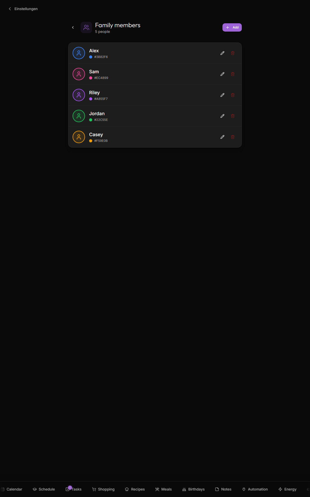
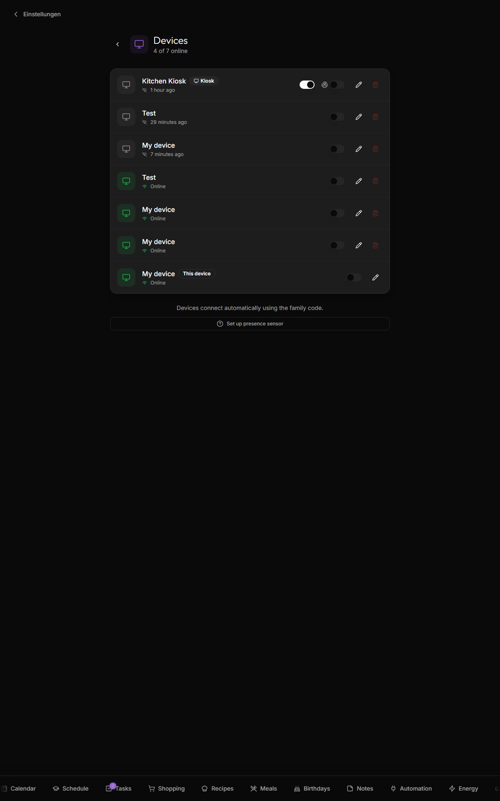

# People and devices

Two adjacent Settings screens for the household: **Family members** (Settings → Family members) is the list of people the app color-codes and assigns things to; **Devices** (Settings → Devices) is the list of phones, tablets, and kiosks that have joined the family. Both are family-scoped and real-time published — edits on one device show up everywhere within ~1 s.

## Family members

Add a person with a name, a color, an avatar (emoji, uploaded image, or external URL), and an optional "child / student" toggle. That's it — the person appears across the app immediately.

### Avatars

Three modes: **emoji** (a curated set of family + pet emoji, renders inline, no bandwidth cost), **uploaded image** (cropped to a circle, scaled to 256×256, stored as a base64 data URL in `people.avatar_url` — locally stored, no CDN), and **external URL** (Gravatar, a Google profile photo, anywhere image-served — depends on the source staying up).

### Colors

Each person's color drives event chips on the calendar, task assignment badges, schedule cell tints, birthday ring dots, the avatar ring on the dashboard, and the mapping-rule preview in [Google-Calendar](Google-Calendar) settings. The palette has 16 swatches; most families use ≤ 6 so repetition isn't an issue.

### "Child / student" toggle

Marks the person as a school-schedule consumer: they become selectable in [Schedule](Schedule), the dashboard's schedule widget can pick them, and their pack list appears on the day-of. Adults and pets stay off.

### Deleting a person

Tap the trash icon → confirm. Cascade behavior, current as of v1.4.0:

- **Pocket-money account** (if any) — **permanently deleted**, balance and history included.
- **School schedules** for them — **permanently deleted**.
- **Events, todos, and birthdays** assigned to them — **kept, unassigned** (events become "family" events, todos become unassigned, birthdays stay but unlinked from the person).

Deleting a person doesn't touch any device — devices and people are independent rows; see below to remove a device.

### Patterns that work well

- **Color = mood**: pick distinctive colors so a glance at the calendar tells you whose events are whose without reading names.
- **Pets get a row**: emoji avatar, no birthday, used for tracking vet appointments.
- **One person per device is not a thing.** Kinboard's auth model is family-scoped, not person-scoped — there's no "active person" login, and no per-person permission roles.

### Persistence

`public.people` table. Real-time published.

## Devices

Each row shows an auto-detected icon, an editable name, an online indicator (green = active in the last 5 minutes, from a 60-second heartbeat), a "this device" badge, and edit/delete actions.

### Kiosk mode toggle

Hides the nav drawer, disables admin actions (creating/leaving a family), and renders larger touch targets for wall-display ergonomics. Toggle on for the wall-mounted display, off for personal devices. It's UI-only — it doesn't add real security. To keep kids from disabling it, set a [Settings PIN](Security-and-Threat-Model#the-settings-pin).

### Presence sensor toggle

Toggle on when an [LD2410 presence sensor](Presence-Sensor) is wired into this device. Reveals the device ID (needed by the presence-sensor script), a live presence indicator, and a "Connection lost" badge if the sensor stops reporting for >30 s.

### Removing a device (revocation)

Tap delete → confirm. The device's row is removed from the family — it can no longer read/write until it re-joins with the family code. **The device's local cookie isn't invalidated**, so a physically-present device just gets logged out, not bricked. You can't remove "this device" from the list (would lock yourself out); use **Settings → Leave family** on the active device instead. Devices that haven't pinged in 30+ days are good candidates to prune — Kinboard doesn't auto-delete stale devices.

### Device fingerprint note

If a browser's cookies/site data are wiped, the device re-creates as a new row with a new ID on next join — the old row stays orphaned and needs manual deletion. Kinboard tries to avoid this by falling back to a browser fingerprint; see [how device recognition works](Security-and-Threat-Model#how-device-recognition-works) for the mechanism and its limits.

**Don't manually edit the `devices` table** unless you know what you're doing — the webapp uses the row's UUID as the active device key in cookies. Renaming a row is fine; deleting or replacing its UUID can strand the device (logs it out, or worse, leaves it pointing at nothing).

### Patterns that work well

- **After adding a family member**: open `/settings/devices`, name each row properly, mark which one is kiosk.
- **Kid-only devices**: set the kiosk toggle even off-wall — it locks down accidental "leave family" taps.

## Related

- [Security-and-Threat-Model](Security-and-Threat-Model) — the auth model, PIN gate, and device recognition mechanism
- [Birthdays](Birthdays) — link a birthday to a person to inherit the color
- [Schedule](Schedule) — the "child" toggle enables school features
- [Google-Calendar](Google-Calendar) — assign Google calendars to people
- [Presence-Sensor](Presence-Sensor) — using a device's ID in the LD2410 script
