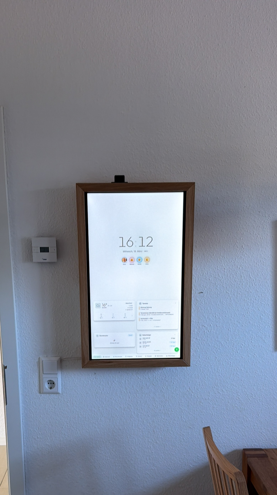
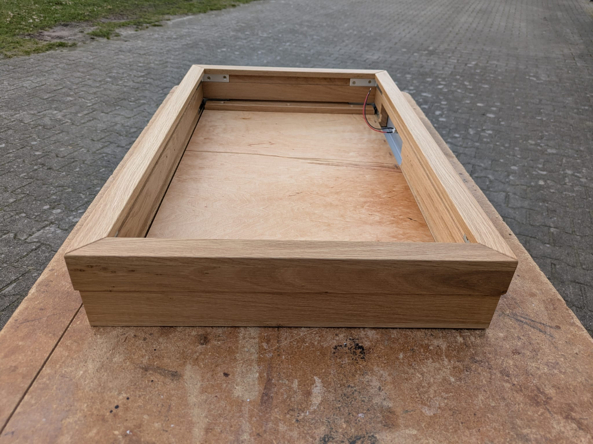
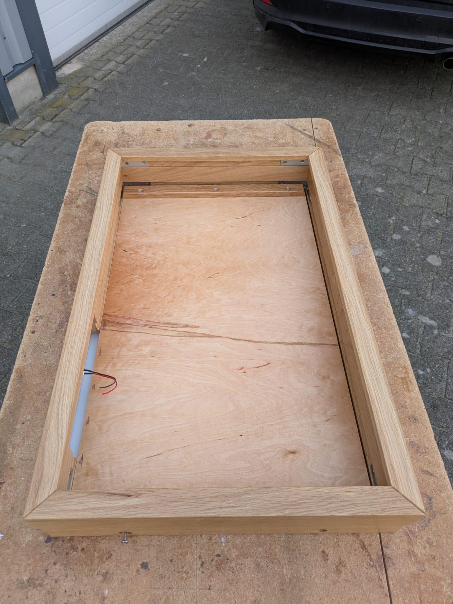

# Reference build — wall-mounted kitchen kiosk

This page documents the **maintainer's actual fielded build**: the components, vendor links, photos, and basic spec sheet for each piece. Kinboard runs on any HDMI display + any small PC, but if you want a known-good combination this is one.

If you only want the software setup on the same hardware, jump to [[Kiosk-Windows-11-Mele-4C]]. This page is the hardware side.

*The kiosk in its current home: portrait orientation, oak frame, single power cable to a Schuko outlet below. The room thermostat to the left isn't part of the build. The small black protrusion above the frame is the LD2410 presence sensor in a printed enclosure.*

## Bill of materials

| Component | Choice | Approx. cost (Q1 2026) |
|---|---:|---:|
| Touchscreen panel | Novomatic 27" open-frame, 1920×1200, capacitive multi-touch USB | €240 (used) |
| Mini PC | Mele Quieter 4C (16 GB / 256 GB eMMC, Intel N100/N150 fanless) | $470 / ~€440 |
| Presence sensor | HLK-LD2410 (or B/C variant) on USB-UART (FTDI/CH340) | €10–15 |
| Wooden frame | Custom oak, hand-built to fit the panel | DIY |
| Cables + PSU | HDMI or DisplayPort cable, USB-A→B (touch), 12V DC PSU (panel), 12V DC PSU (Mele) | ~€20 |
| Mounting hardware | Wall mount of your choice | ~€10 |
| **Total** | | **~€720–€750** |

The Mele is the most expensive piece by a wide margin and the touchscreen is the second. Everything else rounds out the build.
You can use also a RPI 4+ but i wasnt satified with the on screen keyboard various linux dustrubutions deliver.

## Touchscreen — Novomatic 27" open frame

Sourced from comCurrent in Nürnberg via eBay (used / professionally refurbished). Listing format: *"27&quot; 68,6cm TFT 16:9 FULL HD M270HVN02.0 MONITOR TOUCHSCREEN DVI DISPLAYPORT VGA"*.

The model designation `M270HVN02.0` is the underlying **AUO panel**; Novomatic packages the panel + touch overlay + driver board into an open-frame industrial assembly that's typically used in casino displays, POS terminals, or info kiosks. Used units come up regularly because the gambling-machine refresh cycle dumps them onto the secondary market.

### Specs

| | |
|---|---|
| **Diagonal** | 27" / 68.58 cm |
| **Resolution** | 1920×1200 (16:10 — the seller's listing says 16:9 but the panel is 16:10) |
| **Panel type** | TFT LCD, AUO M270HVN02.0 |
| **Touch technology** | Capacitive multi-touch, glass surface |
| **Touch interface** | USB (HID, plug-and-play on Windows 7/10/11; works on Linux without drivers) |
| **Video inputs** | DisplayPort, DVI, VGA |
| **Power** | 12V DC, ~54 W draw, barrel jack, PSU included |
| **Dimensions** | 620 × 370 × 43 mm (W × H × D) |
| **Construction** | Open frame, metal chassis, no integrated stand |
| **Bezel** | Effectively none — the panel + touch glass go right to the edges |

### Why this panel

- **Open-frame** is exactly what you want for a custom-enclosure build like this one. No plastic bezel housing to dispose of, no manufacturer logo, no stand to remove. Just the panel + a metal back chassis with the driver board.
- **DisplayPort** is the cleaner choice over HDMI for a long-running kiosk — better with monitor sleep / wake transitions, no HDCP weirdness.
- **Capacitive** glass-surface multi-touch matches modern phone/tablet ergonomics. Older industrial resistive screens feel awful in 2026.
- **12V DC** input means you can power it from the same buck converter as anything else on the wall.

### Caveats

- "Used" condition. Mine arrived with a few minor scuffs on the back chassis and a working PSU. Verify on arrival.
- VESA mounting holes are present on the back chassis but the listing doesn't specify the pattern. Mine appears to be a non-standard pitch around 200×100 — measure yours before designing brackets. The reference build doesn't use VESA at all; the panel sits in a wooden rabbet (see frame section below).
- The driver board sticks out ~1.5 cm beyond the back of the panel. Account for this in your enclosure depth.
- 1920×1200 isn't 1920×1080. Kinboard's CSS uses a 16:9-ish dashboard layout but renders fine at 16:10 — the slightly extra vertical space is welcome.

### Source

[eBay listing — comCurrent](https://www.ebay.de/itm/317023555500). German-only seller, ships across the EU. About €240 + €9 shipping. They typically have several in stock.

## Mini PC — Mele Quieter 4C

Sourced from [store.mele.cn](https://store.mele.cn/products/mele-quieter-4c-n100-3-4ghz-fanless-mini-computer-lpddr4x-win11-hdmi-4k-wi-fi-5-bt-5-1-usb-3-2-2-usb-2-0-1-type-c-1) directly. Also available via Amazon DE / Amazon US under the same model name.

The Mele Quieter line is one of the few **fanless** mini PCs that runs Windows 11 well. Fanless matters for a kitchen wall — no airborne grease ingestion, no audible whir during the morning silence.

### Specs

| | Spec sheet | This build |
|---|---|---|
| **CPU** | Intel N100, 4 cores, up to 3.4 GHz boost | Intel N150 (newer 2026 hardware revision) |
| **RAM** | LPDDR4, 8 / 16 GB options | 16 GB |
| **Storage** | 128/256 GB eMMC + M.2 SATA expansion + microSD | 256 GB eMMC |
| **GPU** | Intel UHD (integrated), 750 MHz max | Same |
| **Video out** | 2× HDMI 2.0 (4K@60Hz) + USB-C with DP-Alt-Mode | All used: HDMI for the panel, DisplayPort would have worked too via HDMI→DP active adapter, but HDMI direct is simpler |
| **USB** | 2× USB 3.2 Gen 2, 1× USB 2.0, 1× USB-C (data + power input) | One USB 3.2 carries the touch interface back to the PC |
| **Network** | 2.5 GbE Ethernet + Wi-Fi 5 + Bluetooth 5.1 | Wi-Fi only at 192.168.1.x; Ethernet not run to the wall |
| **Audio** | 3.5 mm jack | Unused |
| **Dimensions** | 131 × 81 × 18.3 mm | Same |
| **Weight** | 200 g | Same |
| **Power** | 12V/2A DC, range 12–23V, USB-C PD also accepted | 12V barrel jack, ~7-12 W typical draw |
| **OS** | Windows 11 Pro pre-installed | Windows 11 IoT Enterprise LTSC (build 26100) |

### Hardware revision note

The shipping spec sheet at store.mele.cn lists the **N100** CPU. The unit captured for this wiki reports an **Intel N150** — Mele appears to have refreshed the silicon mid-cycle without renaming the SKU. Both CPUs are Alder Lake-N, ~25 W TDP, integrated UHD graphics. Performance for kiosk-browser duties is indistinguishable.

### Why this mini PC

- **Fanless.** Single biggest reason. A kitchen kiosk that whirs is a kitchen kiosk that gets unplugged within a month.
- **Tiny** (131×81×18 mm) and 200 g. Mounts to the back of the frame with double-sided VHB tape — no metal brackets needed, just stick it on.
- **2× HDMI** + USB-C means you have spare video outputs for development without unplugging the kiosk display.
- **Auto Power On**, **Wake on LAN**, **PXE boot**, **RTC wake** — all the stuff you need for "if power blips, come back up by itself."
- **Windows 11 IoT LTSC** is the killer feature for kiosk use. No forced feature updates, no Edge Bing nag dialogs, no Cortana. The unit ships with regular Win11 Pro; you upgrade to LTSC separately if you have an Enterprise license.
- **VESA mount included** in the box, though the reference build doesn't use it.

### Caveats

- **Wi-Fi 5 only** — no Wi-Fi 6 or 6E. For a kitchen wall a few meters from a router this is fine; if your access point is in the basement and the kiosk is on the second floor, run Ethernet.
- The eMMC storage is fast enough for boot but **slow for sustained writes**. If you do anything write-heavy on the box (recording, large local data), pop in an M.2 SATA SSD.
- US store ships from China; expect 1-3 weeks plus customs. Amazon DE has them with EU stock.
- The included 12V PSU has a fixed-length cable (~1.5 m). May need an extension for behind-the-frame routing.

### Source

[store.mele.cn](https://store.mele.cn/products/mele-quieter-4c-n100-3-4ghz-fanless-mini-computer-lpddr4x-win11-hdmi-4k-wi-fi-5-bt-5-1-usb-3-2-2-usb-2-0-1-type-c-1) (US$ 469.99, ships globally). Amazon DE: search "Mele Quieter 4C 16GB" — typically €420-€480 with EU shipping.

## Wooden frame

The display sits in a **custom-built oak frame** on the kitchen wall, mounted in portrait orientation. The Mele PC and cabling sit hidden behind the frame; the LD2410 presence sensor sits on top.

*Empty frame from a side angle, showing the rabbet that holds the panel and the L-brackets at the corners. Red/black wires at the top are the LD2410 sensor leads.*

*Same frame from above. The horizontal cross-bar at the top of the rabbet is what the panel rests against.*

The frame was built by hand from solid oak to fit this specific 27" panel. Exact dimensions, joinery, rabbet depth, and backing material aren't documented here — anyone reproducing this build would size the frame to whatever panel they sourced. The photos show the general shape.

If you don't want to build a frame yourself, off-the-shelf options that work for this kind of build:

- A deep picture frame from IKEA's Ribba/Sannahed line, with the back cut to fit the panel
- A printed enclosure from a maker like [SmartHomeKit](https://smarthomekit.com/) or similar (search "tablet wall mount enclosure")
- Mount via VESA brackets directly to the wall and skip the frame entirely

## Cabling

The panel and the Mele PC each need their own 12 V DC supply. Both PSUs share a single Schuko outlet via a small power strip routed behind the frame. From the Mele:

- **Video** — HDMI (or DisplayPort via active adapter) to the panel
- **Touch** — USB-A to the panel's USB-B touch interface
- **Sensor** — USB-A → USB-UART → LD2410 leads (only if you've added the presence sensor; see [[Presence-Sensor]])

## Touchscreen calibration

On Windows 11, the panel reports as a generic HID touchscreen and works without a driver. If taps register a few pixels off:

1. Settings → Bluetooth & devices → Touch → **Calibrate the screen for pen or touch input**
2. Pick the right monitor if multi-display
3. Tap the cross-hairs as instructed

For Linux: `xinput_calibrator` (X11) or libinput's calibration matrix in udev rules.

## Power consumption

Approximate, based on the spec-sheet draw of each component (not measured at the wall):

- Mele Quieter 4C: ~7-12 W (idle to load)
- 27" panel at full brightness: ~54 W
- LD2410 sensor + USB-UART: <1 W
- **Total when active: ~60-65 W**

When the presence sensor blanks the display, draw drops to roughly the Mele's idle plus the panel's backlight-off standby. Actual numbers will depend on your panel and Mele's power profile.

## Related

- [[Kiosk-Windows-11-Mele-4C]] — the software setup that runs on this hardware
- [[Presence-Sensor]] — LD2410 wiring + script
- [[Architecture]] — what's running where
