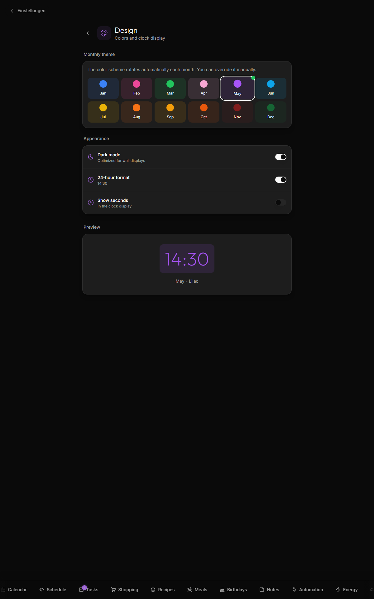

# Themes and locales

## Monthly themes

The accent color of the entire UI **rotates with the month**. January is frost blue, May is lilac, October is pumpkin orange, December is pine. Designed to make the wall display feel seasonal — you glance at it on a March morning and it's spring green; in November it's burgundy.

Defined in `webapp/src/lib/utils.ts` as `getMonthTheme()`. The same logic is mirrored in the CSS via `globals.css` setting `--month-primary` per month class.

The 12 themes:

| Month | Color | Hex |
|---|---|---|
| January | Frost Blue | `#3b82f6` |
| February | Rose Valentine | `#ec4899` |
| March | Spring Green | `#22c55e` |
| April | Cherry Blossom | `#f9a8d4` |
| May | Lilac | `#a855f7` |
| June | Ocean Blue | `#0ea5e9` |
| July | Sunflower | `#eab308` |
| August | Coral | `#f97316` |
| September | Amber | `#f59e0b` |
| October | Pumpkin | `#ea580c` |
| November | Burgundy | `#7f1d1d` |
| December | Pine | `#166534` |

### Manual override

In **Settings → Theme** you can pick any of the 12 themes manually, overriding the monthly default. Click any other tile to set the override; click **Back to automatic** to clear it. The override is per-family (everyone in your household sees the same theme).



The decorative names ("Frost Blue", "Pumpkin", etc.) are kept in English in both locales — they're branding, not user-facing labels. The actual month names beneath each tile localize via `date-fns`.

## Dark / light mode

Settings → Theme → **Dark mode** toggle. Defaults to dark (the kitchen wall display use case). Light mode also works for desktop browsers.

The toggle stores the preference in localStorage; the system preference (`prefers-color-scheme`) is the initial default.

## Time format

Settings → Theme → **24-hour format** toggle. Affects the clock widget + every event/todo time across the app. Stored in `settings.theme.use24Hour`.

Settings → Theme → **Show seconds** toggle. Adds `:ss` to the clock widget. Stored in `settings.theme.showSeconds`.

## Text size

Settings → Theme → **Text size**: three sizes (small / medium / large). Stored **per device** in `localStorage`, not per family — so a wall kiosk can go large enough to read from across the kitchen while everyone's phones stay at a normal size. Applies app-wide, not just the clock.

## Locales

Kinboard ships **English (en)**, **German (de)**, and **French (fr)** out of the box. The whole UI is translated — 2200+ strings, parity-checked in CI. Push notification text also follows the family's chosen language (with correct pluralization in all three), not just the UI.

### Switching locale

**Settings → Language** has a picker — no browser console needed. It sets a `NEXT_LOCALE` cookie for the current device (so each device can run its own language) and also saves a family-level default, used only when a server-side process without a request cookie needs a language — push notification text and cron-generated messages.

The same Settings → Language page also has a **country picker** for holidays — Germany, US, UK, Netherlands, or France — independent of the UI locale (a German-speaking family living in the US can pick `de` for the UI and `us` for holidays). Existing families default to Germany. See [Calendar → Holidays](Calendar#holidays).

### Architecture

- `next-intl` for everything user-facing
- Bundles in `webapp/messages/{en,de}.json` (one bundle per locale)
- Each component uses `useTranslations("namespace")(key)` rather than hardcoded strings
- Date / time / number formatting via `date-fns` with `de | enUS` locales, plus `Intl.DateTimeFormat` (`"de-DE"` vs `"en-US"`)

The bundles are deeply nested by feature. Top-level namespaces:

```
common, components, nav, holidays, shoppingCategories, mealHints,
cameras, notes, schedule, birthdays, todos, meals, recipes, shopping,
settings (with widgets, theme, screensaver, weather, notifications,
bring, devices, cameras, people, homeassistant, homeassistantRooms,
homeassistantEnergy, photos, google, tesla, schedule sub-namespaces),
einkaufen, calendar, weather, homeAutomation, dashboard, clock,
todayStrip, mealPlanWidget, tesla, familyMembers, tasksWidget,
notesWidget, wasteCollectionWidget, weekOverviewWidget,
upcomingEvents, birthdayWidget, scheduleWidget, energy, join
```

## Adding a new locale

1. Copy `webapp/messages/en.json` to `webapp/messages/<locale>.json`. Replace English values with translations; keep keys identical.
2. Register the locale in `webapp/src/i18n/`:

   ```ts
   // webapp/src/i18n/locales.ts (or wherever you keep the locale list)
   export const locales = ["en", "de", "<your-locale>"] as const;
   ```

3. For `date-fns` formatting, import the matching locale and add the conditional in places that pick `dateLocale`:

   ```ts
   import { de, enUS, fr } from "date-fns/locale";
   const dateLocale = locale === "de" ? de : locale === "fr" ? fr : enUS;
   ```

4. Add the locale to the CI parity check list (`.github/workflows/ci.yml` → the `i18n-validate` job)
5. Submit a PR. Partial coverage is fine — falling back to English for missing keys is standard `next-intl` behavior.

## Adding new strings

Always add to **both** `en.json` and `de.json`. The CI's `i18n-validate` job fails the PR if either is missing keys.

Convention for new keys:

- Use `camelCase` for keys
- Group by feature in a sub-namespace (`feature.subfeature.specificThing`)
- For enum values (kebab-case in code, like `"bed-double"`), use a `_` separator in the translation key (`iconLabel_bedDouble`) — JSON keys can't contain hyphens cleanly

For plurals, use ICU MessageFormat:

```json
{
  "itemCount": "{count, plural, one {# item} other {# items}}"
}
```

For inline-styled chunks, use `t.rich()` with named tags:

```json
{
  "presenceUnavailableHint": "Enable it in <link>device settings</link>."
}
```

```tsx
{t.rich("presenceUnavailableHint", {
  link: (chunks) => <span className="text-month-primary">{chunks}</span>
})}
```

## German-specific gotchas

- The original repo was German-first; many internal IDs in DB still use German keys (e.g. `obst_gemuese` for the fruits-and-vegetables shopping category). Don't rename these — they're stable identifiers; only the displayed labels are translated.
- Holidays live in `webapp/src/lib/holidays/<country-code>.ts` (`de`, `us`, `uk`, `nl`, `fr` today), one file per country, selected via the Settings → Language country picker. Add a new country by dropping in another `<country-code>.ts` provider and registering it in `webapp/src/lib/holidays/index.ts`.

## Related

- [Architecture](Architecture) — where the i18n bundles live
- [Calendar](Calendar#holidays) — where the country picker's effect shows up
- See [`webapp/messages/en.json`](https://github.com/svenger87/kinboard/blob/main/webapp/messages/en.json) for the source of truth
